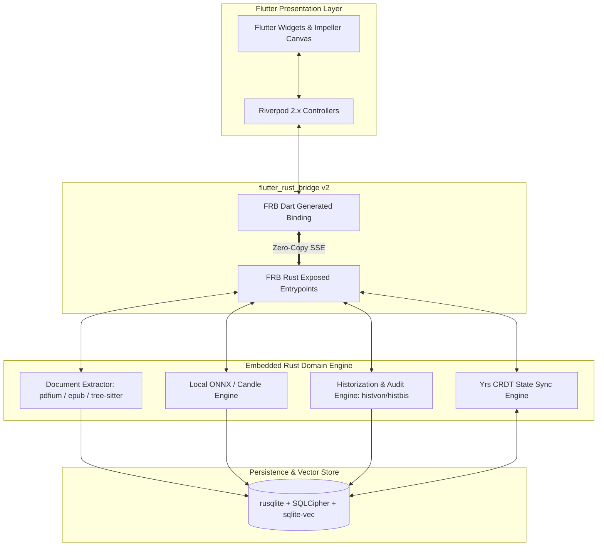

# Software Architecture Document (SAD)
## Zero-Backend AI Speed Reading & Knowledge Platform

> [!IMPORTANT]
> **SINGLE SOURCE OF TRUTH (SSOT) - ARCHITECTURAL BLUEPRINT**  
> This document, alongside [`docs/complete_end_to_end_implementation.md`](file:///Users/yashpratap/Documents/GitHub/Agama/docs/complete_end_to_end_implementation.md), [`docs/schema.md`](file:///Users/yashpratap/Documents/GitHub/Agama/docs/schema.md), and [`docs/decentralized_sync_architecture.md`](file:///Users/yashpratap/Documents/GitHub/Agama/docs/decentralized_sync_architecture.md), serves as the authoritative, active Single Source of Truth for the Agama software architecture, database schema, sync mechanics, and technical implementation.

---

## Document Traceability & Cross-Reference Index

| Document Role | File Path | Status | Description / Relationship |
| --- | --- | --- | --- |
| **System Architecture (SAD)** | [`docs/SAD.md`](file:///Users/yashpratap/Documents/GitHub/Agama/docs/SAD.md) | **ACTIVE (SSOT)** | ISO/IEC/IEEE 42010 Architectural Description, ADRs, & System Topology. |
| **Decentralized Sync Spec** | [`docs/decentralized_sync_architecture.md`](file:///Users/yashpratap/Documents/GitHub/Agama/docs/decentralized_sync_architecture.md) | **ACTIVE (SSOT)** | Deep-dive specification into WebDAV, iCloud, P2P, E2EE, and Yrs CRDT delta syncing. |
| **Database Schema (SSOT)** | [`docs/schema.md`](file:///Users/yashpratap/Documents/GitHub/Agama/docs/schema.md) | **ACTIVE (SSOT)** | Complete SQLite DDL, Field Dictionary, `histvon`/`histbis` Historization & Vector Indexing. |
| **Master Implementation Spec** | [`docs/complete_end_to_end_implementation.md`](file:///Users/yashpratap/Documents/GitHub/Agama/docs/complete_end_to_end_implementation.md) | **ACTIVE (SSOT)** | End-to-end technical feature specification, Cargo.toml & pubspec.yaml manifests. |
| **Core Local Strategy** | [`docs/implementation_no_backend.md`](file:///Users/yashpratap/Documents/GitHub/Agama/docs/implementation_no_backend.md) | **ACTIVE REFERENCE** | Initial technical specification for the local-first Rust + Flutter architecture. |
| **Market & Cognitive Research** | [`docs/Speed_Reading_Apps_Detailed_Market_Analysis.md`](file:///Users/yashpratap/Documents/GitHub/Agama/docs/Speed_Reading_Apps_Detailed_Market_Analysis.md) | **ACTIVE REFERENCE** | Competitor analysis (Spreeder, Outread, Bionic Reading, Spritz) & scientific limitations. |
| **Cloud Backend Spec** | [`docs/implementation_plan_advance.md`](file:///Users/yashpratap/Documents/GitHub/Agama/docs/implementation_plan_advance.md) | 🛑 **ON HOLD** | Cloud-backend microservices spec. Placed on hold in favor of Zero-Backend architecture. |

---

## 1. Executive Architecture Summary

**Document Standard:** ISO/IEC/IEEE 42010 & IEEE 1016 Architectural Description  
**Document Version:** 1.6.0  
**Date:** August 2026  
**Status:** Approved Architectural Reference  
**Author:** Principal Software Architect & CTO  

### 1.1 Architectural Vision
The **Agama Platform** is engineered as a high-performance, local-first, zero-backend multi-platform application (iOS, Android, macOS, Windows). By shifting computational execution (PDF layout reconstruction, ONNX NLP inference, vector indexing, and state management) completely into an embedded native Rust core, the system achieves:
- **Zero Cloud Runtime Costs:** $0 server infrastructure for document processing or AI inference.
- **Absolute Privacy & Data Sovereignty:** 100% of user books, papers, highlights, and vector embeddings remain on-device.
- **Zero-Latency Interaction:** Instant UI responsiveness powered by custom Flutter `Impeller` GPU painters communicating with Rust via zero-copy C-ABI asynchronous streams.
- **Auditable Historization (`histvon` / `histbis`):** Immutable historical tracking across all entities using 17-character timestamps (`YYYYMMDDHHMMSSSSS`) with active entries marked as `histbis = '9999'` (Detailed in [`docs/schema.md`](file:///Users/yashpratap/Documents/GitHub/Agama/docs/schema.md)).
- **Decentralized Synchronization:** Peer-to-peer or user-owned cloud synchronization (iCloud, WebDAV, local network CRDTs) without centralized app servers (Detailed in [`docs/decentralized_sync_architecture.md`](file:///Users/yashpratap/Documents/GitHub/Agama/docs/decentralized_sync_architecture.md)).

---

## 2. Architectural Representation & Views

```
                                  SYSTEM ARCHITECTURAL VIEWS
+-----------------------+-----------------------+-----------------------+-----------------------+
|  2.1 LOGICAL VIEW     |  2.2 PROCESS VIEW     |  2.3 DEVELOPMENT VIEW |  2.4 DEPLOYMENT VIEW  |
| - Presentation Layer  | - Event Loop & Tokio  | - Monorepo Structure  | - iOS/Android Apps    |
| - Bridge Adapter      | - Zero-Copy SSE Stream| - Rust Core Crate     | - macOS/Windows Exe   |
| - Embedded Core Engine| - Custom Canvas Render| - Flutter App Shell   | - Native Bundled Dynamic|
+-----------------------+-----------------------+-----------------------+-----------------------+
```

### 2.1 Logical View (Layered Architecture)



---

## 3. Data Architecture & Historization Pattern

### 3.1 Historization Concept (`histvon` / `histbis`)
For complete relational DDL, column data dictionaries, vector virtual tables, and partial indexes, refer to the master schema specification at [`docs/schema.md`](file:///Users/yashpratap/Documents/GitHub/Agama/docs/schema.md).

---

## 4. Key Architectural Decision Records (ADRs)

### ADR-01: Flutter Shell + Embedded Rust Engine Core
* **Status:** Accepted
* **Context:** High-frequency RSVP rendering (120 FPS) requires isolated background parsing, vector indexing, and ONNX execution without UI thread jank.
* **Decision:** Embed a native Rust crate (`rust_core`) compiled into native libraries (`.dylib`, `.so`, `.dll`) bound to Flutter via FFI.

### ADR-02: Zero-Copy `flutter_rust_bridge` v2 for Inter-Process Communication
* **Status:** Accepted
* **Context:** Streaming hundreds of words per second over standard JSON string FFI causes serialization overhead and UI frame stutter.
* **Decision:** Adopt `flutter_rust_bridge` v2 using Simple Serialized Extension (SSE) binary codecs.

### ADR-03: `SQLCipher` + `sqlite-vec` for Embedded Encrypted RAG
* **Status:** Accepted
* **Context:** Need instant semantic vector similarity search across user highlights without sending raw documents to external cloud vector databases.
* **Decision:** Embed `sqlite-vec` directly into `rusqlite` connections encrypted with 256-bit AES-CBC `SQLCipher`.

### ADR-04: On-Device Quantized ONNX Runtime (`ort`) for Dynamic Pacing
* **Status:** Accepted
* **Context:** Cloud NLP inference introduces 300ms+ network latency per paragraph and incurs recurring SaaS API costs.
* **Decision:** Execute quantized 8-bit MiniLM-L6-v2 ONNX models locally inside Rust using hardware NPU/GPU execution providers (CoreML, DirectML, NNAPI).

### ADR-05: Decentralized CRDT Sync (`Yrs`) over User-Owned Storage
* **Status:** Accepted
* **Context:** Eliminates central user account databases, cloud server hosting costs, and user privacy risks.
* **Decision:** Utilize state-based CRDTs (`Yrs` Rust port of Yjs) with AES-GCM-256 E2EE state deltas exported to user-owned iCloud, WebDAV, or local network P2P channels.

### ADR-06: 17-Character `histvon` / `histbis` Historization Pattern
* **Status:** Accepted
* **Context:** Need auditability, historical time-travel querying, and non-destructive soft updates without complex mutation logs.
* **Decision:** Implement `histvon` (created / valid from timestamp formatted `YYYYMMDDHHMMSSSSS`) and `histbis` (valid until timestamp, set to `'9999'` for active records).

### ADR-07: Simultaneous Monorepo Bootstrap Strategy
* **Status:** Accepted (Aligned via Grill-Me Interview)
* **Context:** Determining how to structure initial Phase 1 codebase scaffolding.
* **Decision:** Initialize Flutter shell and Rust core crate simultaneously in a monorepo, generating `flutter_rust_bridge` v2 bindings from day one so Dart and Rust communicate seamlessly from start of development.

### ADR-08: Automatic PDFium Native Binary Management
* **Status:** Accepted (Aligned via Grill-Me Interview)
* **Context:** Managing pre-compiled native PDFium shared libraries (`.so`, `.dylib`, `.dll`) across developer workstations and CI/CD targets.
* **Decision:** Use `pdfium-render` build script features to automatically fetch official pre-compiled PDFium dynamic binaries during `cargo build`.

### ADR-09: Bundled App Asset Packaging for ONNX NLP Models
* **Status:** Accepted (Aligned via Grill-Me Interview)
* **Context:** Distributing the 23MB quantized `MiniLM-L6-v2` ONNX model and tokenizer.
* **Decision:** Bundle ONNX model assets inside Flutter app assets (`assets/models/`) and pass byte pointers/paths across the FFI boundary to Rust during engine startup.

### ADR-10: Biometric Hardware Key Storage for SQLCipher Encryption
* **Status:** Accepted (Aligned via Grill-Me Interview)
* **Context:** Initializing and protecting master 256-bit database encryption key.
* **Decision:** Auto-generate a 256-bit hardware key on first app launch stored in OS Secure Enclave / Keystore via `flutter_secure_storage` unlocked via local biometrics (`local_auth`).

### ADR-11: WebDAV First Priority for Decentralized Sync Outbox
* **Status:** Accepted (Aligned via Grill-Me Interview)
* **Context:** Implementation ordering for decentralized sync backends.
* **Decision:** Implement WebDAV sync first (broad compatibility across iOS, Android, macOS, Windows via Nextcloud/Hetzner), followed by iCloud and local Wi-Fi P2P (Detailed in [`docs/decentralized_sync_architecture.md`](file:///Users/yashpratap/Documents/GitHub/Agama/docs/decentralized_sync_architecture.md)).

---

## 5. Backward & Forward Document Linkage Matrix

- **Forward Link to Decentralized Sync Spec:** [`docs/decentralized_sync_architecture.md`](file:///Users/yashpratap/Documents/GitHub/Agama/docs/decentralized_sync_architecture.md)
- **Forward Link to Database Schema:** [`docs/schema.md`](file:///Users/yashpratap/Documents/GitHub/Agama/docs/schema.md) *(Master Database Schema)*
- **Forward Link to Implementation Spec:** [`docs/complete_end_to_end_implementation.md`](file:///Users/yashpratap/Documents/GitHub/Agama/docs/complete_end_to_end_implementation.md)
- **Backward Link to Market Baseline:** [`docs/Speed_Reading_Apps_Detailed_Market_Analysis.md`](file:///Users/yashpratap/Documents/GitHub/Agama/docs/Speed_Reading_Apps_Detailed_Market_Analysis.md)
- **Backward Link to Strategy Doc:** [`docs/implementation_no_backend.md`](file:///Users/yashpratap/Documents/GitHub/Agama/docs/implementation_no_backend.md)
- **Archived Reference:** [`docs/implementation_plan_advance.md`](file:///Users/yashpratap/Documents/GitHub/Agama/docs/implementation_plan_advance.md) *(ON HOLD)*

---
*Software Architecture Document approved as active Single Source of Truth.*
