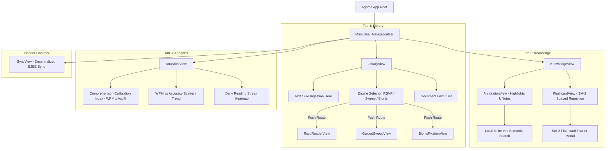

# Agama Platform — App UI/UX Flow & Visual Guide

> **Document Version:** 1.0.0  
> **Target Audience:** UI/UX Designers, Frontend Engineers (Flutter/Web), Product Managers  
> **Platform Scope:** Cross-platform (Desktop macOS/Linux/Windows, Mobile iOS/Android, Web Chrome)  
> **Design Philosophy:** Local-First, Zero-Latency, Optometric Instrument Precision

---

## 1. Executive Summary & Brand Identity

**Agama** is a local-first, zero-backend speed reading and knowledge retention workspace. Unlike consumer reading apps styled like warm digital books, Agama's aesthetic is modeled after **precision optometric instruments, typographic specimens, and high-focus laboratory measurement tools**.

### Core Visual Principles
1. **Instrument Aesthetics over Decorative Flair:** Clean cool background tones, ultra-crisp hairline borders, flat zero-shadow surfaces, and data-dense layouts.
2. **The Single Focus Rule:** Crimson (`#EF4444`) is **reserved exclusively** for the Optimal Recognition Point (ORP) redicle anchor in the RSVP reader. It is *never* used for error states, destructive buttons, or decorative badges.
3. **Monospaced Data Precision:** All numerical indicators (WPM, Comprehension Calibration Index, latency, percentage progress, file sizes) use `JetBrains Mono`.
4. **Distraction-Free Reading Velocity:** Dynamic viewports maintain maximum optical contrast with zero visual noise during high-speed reading streams (up to 1,000 WPM).

---

## 2. Visual Design System & Design Tokens

### 2.1 Color Palette & Token Matrix

| Token Name | Hex Code | Visual Role & Constraints |
| :--- | :--- | :--- |
| `page-bg` | `#F4F6FB` | Cool pearl canvas — precision instrument background |
| `surface` | `#FFFFFF` | Primary card background, app bar, navigation container |
| `surface-variant` | `#F0F2F8` | Input fill, chip background, hovered state fill |
| `ink` | `#1C2033` | Deep blue-black — headers, primary typography, dark icons |
| `ink-muted` | `#5A6275` | Secondary text, body copy, metadata labels |
| `ink-faint` | `#8C95A8` | Eyebrow section headers, subtle captions, disabled states |
| `border` | `#E4E7EF` | Default 1px hairline border for cards, inputs, dividers |
| `border-strong` | `#C8CEDE` | Focused input border, active card outline, hover state border |
| `indigo` | `#4F46E5` | Primary action button, active tab indicator, selection state |
| `indigo-light` | `#EEEDFF` | Active navigation pill background, selected chip background |
| `emerald` | `#059669` | Speed indicators, live local status dot, successful sync |
| `amber` | `#D97706` | Text complexity warning badge, bionic mode active marker |
| `crimson` | `#EF4444` | **RESERVED EXCLUSIVELY FOR ORP REDICLE** — Fixation focal point |
| `rsvp-viewport` | `#0A0D17` | Ultra-dark slate background for RSVP stream viewport |

```
+-----------------------------------------------------------------------------------+
|                                COLOR PALETTE SCHEME                               |
+-----------------------------------------------------------------------------------+
|  [#F4F6FB] Page Canvas   | [#FFFFFF] Surface        | [#1C2033] Ink Main Text     |
|  [#4F46E5] Indigo Accent | [#059669] Emerald Speed  | [#D97706] Amber Complexity  |
|  [#0A0D17] RSVP Viewport | [#EF4444] ORP Redicle    | [#E4E7EF] Hairline Border   |
+-----------------------------------------------------------------------------------+
```

---

### 2.2 Typography Hierarchy

Agama pairs three distinct font families to establish structural clarity:
* **Display Font:** `Outfit` (Geometric, confident, clean tracking at large sizes)
* **Body Font:** `Inter` (Optimized readability, 1.65 line-height ratio)
* **Mono Font:** `JetBrains Mono` (Numeric metrics, WPM values, status codes)

#### Typographic Scale Table

| Level | Font Family | Size | Weight | Tracking | Line Height | Application |
| :--- | :--- | :--- | :--- | :--- | :--- | :--- |
| `displayLarge` | Outfit | `36px` | 800 | `-1.0px` | `1.15` | Hero title in Library view |
| `displayMedium`| Outfit | `28px` | 700 | `-0.8px` | `1.20` | Reader & Analytics headers |
| `titleLarge` | Outfit | `18px` | 700 | `-0.3px` | `1.30` | Document card titles |
| `titleSmall` | Outfit | `13px` | 600 | `0.0px` | `1.40` | Row headers, table labels |
| `bodyLarge` | Inter | `15px` | 400 | `0.0px` | `1.65` | Reading prose & marginalia |
| `bodySmall` | Inter | `12px` | 400 | `0.0px` | `1.50` | Metadata, document dates |
| `labelLarge` | JetBrains Mono | `12px` | 700 | `+0.6px` | `1.50` | WPM counters, %, latency |
| `labelSmall` | JetBrains Mono | `10px` | 500 | `+0.3px` | `1.40` | Section eyebrows, tags |

---

### 2.3 Layout, Elevation & Shape Rules

```
┌────────────────────────────────────────────────────────────────────────┐
│                        LAYOUT & ELEVATION MATRIX                       │
├──────────────────────────┬─────────────────────────────────────────────┤
│ Max Content Container    │ 960px centered                              │
│ Prose Reading Measure    │ 680px centered (optimal line length)        │
│ Card Radius              │ 12px (crisp instrument edge)                │
│ Button Radius            │ 9px                                         │
│ Chip / Tag Radius        │ 8px                                         │
│ Elevation Standard       │ Flat — Hairline border (#E4E7EF) over shadow│
│ Horizontal Padding       │ Mobile: 20px | Desktop/Tablet: 24px         │
└──────────────────────────┴─────────────────────────────────────────────┘
```

---

## 3. Application Architecture & Navigation Flow

Agama uses a **persistent bottom navigation bar** on mobile/desktop with direct modal push routes for dedicated reading modes.

### 3.1 App Navigation Tree (Mermaid Diagram)



---

### 3.2 Main User Journey State Machine

```
   ┌────────────────┐      Ingest Text/PDF      ┌──────────────────┐
   │  Library Hub   │ ────────────────────────> │ Engine Chooser   │
   └────────────────┘                           └──────────────────┘
           ▲                                             │
           │                                 Select Engine & Launch
           │                                             ▼
   ┌────────────────┐     Complete / Close      ┌──────────────────┐
   │ Analytics View │ <──────────────────────── │ Speed Reader     │
   └────────────────┘                           └──────────────────┘
           ▲                                             │
           │                                      Highlight / Note
           │                                             ▼
   ┌────────────────┐      Generate Cards       ┌──────────────────┐
   │ SM-2 Flashcard │ <──────────────────────── │ Annotation View  │
   │    Trainer     │                           └──────────────────┘
   └────────────────┘
```

---

## 4. Screen-by-Screen UI/UX Detailed Wireframe & Specs

### 4.1 Screen 1: Library View (`LibraryView`)

The main entry screen combining quick file/text ingestion, engine selection with trade-offs, and recent reading list.

```
+-----------------------------------------------------------------------------------+
| AGAMA [A]                                               (🟢 Local | ☁️ Sync)       |
+-----------------------------------------------------------------------------------+
|                                                                                   |
|  HERO SECTION                                                                     |
|  [ Paste document text or drag & drop PDF / EPUB / Markdown file here ]          |
|  [ Ingest Document Button ]                                                       |
|                                                                                   |
| --------------------------------------------------------------------------------- |
|  SELECT SPEED READING ENGINE                                                      |
|  +------------------------+ +------------------------+ +------------------------+ |
|  | [x] RSVP Redicle       | | [ ] Guided Sweep       | | [ ] Bionic Fixation   | |
|  | 300 - 1000 WPM         | | 200 - 600 WPM          | | 250 - 700 WPM          | |
|  +------------------------+ +------------------------+ +------------------------+ |
|                                                                                   |
|  +------------------------------------------------------------------------------+ |
|  | ENGINE DETAILS: RSVP Redicle Engine                                          | |
|  | High-speed single-word focal presentation centered on Optimal Recognition     | |
|  | Point (ORP). Best for maximum raw speed scanning.                            | |
|  | [ Start Reading Button ]                                                     | |
|  +------------------------------------------------------------------------------+ |
|                                                                                   |
| --------------------------------------------------------------------------------- |
|  RECENT DOCUMENTS                                                                 |
|  +------------------------------------------------------------------------------+ |
|  | [PDF] Zero-Backend Architecture Spec.pdf      65% done | 450 WPM | 12m ago     | |
|  | [MD]  Decentralized Sync Protocol.md          100% done| 520 WPM | 2h ago      | |
|  +------------------------------------------------------------------------------+ |
|                                                                                   |
+-----------------------------------------------------------------------------------+
|  [📚 Library]                   [🧠 Knowledge]                [📊 Analytics]       |
+-----------------------------------------------------------------------------------+
```

#### Key UX Invariants for Library Tab:
* **Engine Chooser:** Must explicitly display trade-offs, WPM range, and "Best For" guidance before user commits.
* **No File Picker Dep Required:** Pasting text is supported out-of-the-box for quick desktop/mobile demo.

---

### 4.2 Screen 2: RSVP Reader Viewport (`RsvpReaderView`)

High-velocity reading viewport rendering words at exact ORP focal positions.

```
+-----------------------------------------------------------------------------------+
| ← Back to Library                 Doc: Architecture_Spec.pdf          [⚙️ Settings]|
+-----------------------------------------------------------------------------------+
|                                                                                   |
|  +-----------------------------------------------------------------------------+  |
|  |                                                                             |  |
|  |                    Context: ... the zero backend platform ...               |  |
|  |                                                                             |  |
|  |                                    │                                        |  |
|  |                             archit │ e │ cture                              |  |
|  |                                    │                                        |  |
|  |                               (ORP Crimson Anchor)                          |  |
|  |                                                                             |  |
|  +-----------------------------------------------------------------------------+  |
|                                                                                   |
|  PACING CONTROL DECK                                                              |
|  [  ▶ Play  ]   WPM: 450  [ ➖ 50 WPM ] [ ➕ 50 WPM ]    Pace: Optimal (350-500)    |
|                                                                                   |
|  KEYBOARD SHORTCUTS:                                                              |
|  [Space] Play/Pause  |  [← / →] Step Word  |  [↑ / ↓] Speed ±50 WPM  |  [Esc] Exit|
+-----------------------------------------------------------------------------------+
```

#### Micro-Interaction & ORP Math Rule:
* **ORP Position Formula:**  
  $$\text{ORP Index} = \text{round}((\text{Word Length} - 1) \times 0.35)$$
* **Redicle Anchor:** The letter at the ORP Index is colored Crimson (`#EF4444`).
* **Context Strip:** Displays 3 words before + 3 words after current word in faint ink (`#8C95A8`) to prevent disorientation.

---

### 4.3 Screen 3: Knowledge & Annotation Hub (`AnnotationView`)

Central repository for document highlights, inline marginalia notes, and vector similarity search.

```
+-----------------------------------------------------------------------------------+
| KNOWLEDGE & ANNOTATIONS                                                           |
+-----------------------------------------------------------------------------------+
|  🔍 [ Type semantic search query (e.g. "zero backend Yrs sync")...          ]     |
|  Filter Chips: [All (14)] [PDF Specs (8)] [Notes Only (6)]                        |
| --------------------------------------------------------------------------------- |
|                                                                                   |
|  ANNOTATION CARD 1                                                                |
|  "Built-in Yrs CRDT state vectors allow zero-server multi-device synchronization."|
|  Source: Decentralized Sync Architecture.md | Highlight: Yellow                   |
|  Note: "Enables WebDAV + iCloud sync with 0 conflict risk."                        |
|  [ Auto-Generate Flashcard Button ]                                               |
| --------------------------------------------------------------------------------- |
|  ANNOTATION CARD 2                                                                |
|  "SQLCipher 256-bit AES database encryption preserves air-gapped privacy."        |
|  Source: Security Specs.pdf | Highlight: Emerald                                  |
|  [ Auto-Generate Flashcard Button ]                                               |
+-----------------------------------------------------------------------------------+
|  [📚 Library]                   [🧠 Knowledge]                [📊 Analytics]       |
+-----------------------------------------------------------------------------------+
```

---

### 4.4 Screen 4: SM-2 Spaced Repetition Flashcards (`FlashcardView`)

Active-recall trainer implementing the SuperMemo-2 algorithm for long-term retention.

```
+-----------------------------------------------------------------------------------+
| SM-2 FLASHCARD TRAINER                                 Deck: Architecture Specs   |
+-----------------------------------------------------------------------------------+
|                                                                                   |
|  +-----------------------------------------------------------------------------+  |
|  |  CARD 3 of 12                                            Interval: 6 Days   |  |
|  |                                                                             |  |
|  |  QUESTION:                                                                  |  |
|  |  What algorithm is used by Agama for local vector similarity search?        |  |
|  |                                                                             |  |
|  |  -------------------------------------------------------------------------  |  |
|  |                                                                             |  |
|  |  [ Tap / Click to Reveal Answer ]                                           |  |
|  |                                                                             |  |
|  |  ANSWER (REVEALED):                                                         |  |
|  |  sqlite-vec computing cosine similarity on 384-dimensional dense vectors.   |  |
|  |                                                                             |  |
|  +-----------------------------------------------------------------------------+  |
|                                                                                   |
|  RATE RECALL QUALITY (SM-2):                                                      |
|  [ 0 - Blackout ] [ 1 - Wrong ] [ 2 - Hard ] [ 3 - Good ] [ 4 - Easy ] [ 5 - Perfect ]
+-----------------------------------------------------------------------------------+
```

---

### 4.5 Screen 5: Analytics View (`AnalyticsView`)

Dashboard displaying the Comprehension Calibration Index (CCI) and velocity analytics.

```
+-----------------------------------------------------------------------------------+
| COMPREHENSION CALIBRATION ANALYTICS                                               |
+-----------------------------------------------------------------------------------+
|                                                                                   |
|  +------------------------+ +------------------------+ +------------------------+ |
|  | CCI SCORE              | | AVG READING SPEED      | | QUIZ RETENTION ACCURACY| |
|  | 412 CCI                | | 465 WPM                | | 88.6%                  | |
|  | Optimal Zone (350-450) | | JetBrains Mono         | | JetBrains Mono         | |
|  +------------------------+ +------------------------+ +------------------------+ |
|                                                                                   |
|  CCI FORMULA:                                                                     |
|  CCI = Average WPM * ( Quiz Accuracy % / 100 )                                    |
|                                                                                   |
|  READING SPEED VS COMPREHENSION SCATTER TREND                                      |
|  [ Chart Placeholder: WPM on X-axis vs Accuracy % on Y-axis ]                     |
|                                                                                   |
+-----------------------------------------------------------------------------------+
|  [📚 Library]                   [🧠 Knowledge]                [📊 Analytics]       |
+-----------------------------------------------------------------------------------+
```

---

### 4.6 Screen 6: Decentralized Sync & Outbox Monitor (`SyncView`)

Configuration modal for zero-server synchronization across WebDAV, iCloud, or P2P.

```
+-----------------------------------------------------------------------------------+
| DECENTRALIZED SYNC SETTINGS                                            [ Close ✖ ]|
+-----------------------------------------------------------------------------------+
|                                                                                   |
|  PROVIDER STATUS                                                                  |
|  [x] WebDAV (Nextcloud)    Status: Connected | Last Sync: 2m ago                  |
|  [ ] Apple iCloud Drive    Status: Available                                      |
|  [ ] Local Wi-Fi P2P       Status: Scanning (mDNS)                                |
|                                                                                   |
|  UN-SYNCED CRDT OUTBOX STREAM                                                     |
|  +------------------------------------------------------------------------------+ |
|  | 3 pending Yrs state vector deltas waiting to push                            | |
|  | [ Sync Now Button ]                                                          | |
|  +------------------------------------------------------------------------------+ |
+-----------------------------------------------------------------------------------+
```

---

## 5. Accessibility, Responsive Layout & Invariants Checklist

### 5.1 Accessibility (WCAG 2.1 AA Compliance)
- [x] **Contrast Ratio:** Text ink `#1C2033` on `#FFFFFF` surface yields a **15.8:1 contrast ratio** (exceeds AAA requirement of 7:1).
- [x] **RSVP Contrast:** Crimson ORP `#EF4444` on dark viewport `#0A0D17` provides optimal focal visibility without blinding glare.
- [x] **Keyboard Navigation:** Full desktop keyboard support (`Space`, arrows, `Esc`, `Tab`).

### 5.2 Responsive Breakpoints
- **Mobile (`< 600px`):** Single column layout, full-width document cards, bottom `NavigationBar` visible.
- **Tablet (`600px - 1024px`):** 2-column document card grid, constrained `680px` reading measure.
- **Desktop (`> 1024px`):** Max container width `960px`, side-by-side annotation and document viewer cards.

### 5.3 Mandatory Agama UX Invariants
1. **Single Focus Crimson Rule:** Crimson `#EF4444` is *never* used except for the RSVP ORP anchor letter.
2. **Context Strip Preserved:** RSVP reader *always* shows ±3 words surrounding context strip.
3. **No Dead Action SnackBars:** Interactive options must navigate directly to the target view.
4. **JetBrains Mono Standard:** All WPM speeds, latency numbers, and percentage figures *must* render in JetBrains Mono.

---
*Agama App UI/UX Flow & Visual Guide — End of Specification*
