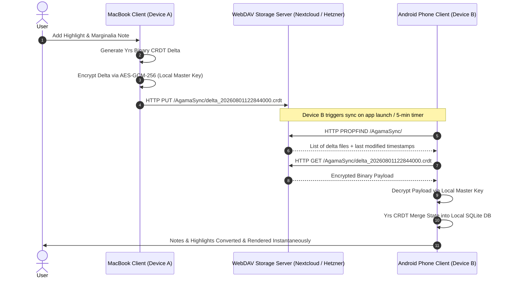

# Decentralized Sync Architecture Specification
## Zero-Backend, End-to-End Encrypted (E2EE) State Synchronization

> [!IMPORTANT]
> **SINGLE SOURCE OF TRUTH (SSOT) - DECENTRALIZED SYNC ARCHITECTURE**  
> This document specifies the architectural rationale, sequence flows, conflict-free state convergence (Yrs CRDTs), End-to-End Encryption (E2EE), and multi-channel synchronization mechanics (WebDAV, iCloud, Local Wi-Fi P2P) for the Agama platform.

---

## Document Traceability & Cross-Reference Index

| Document Role | File Path | Status | Description / Relationship |
| --- | --- | --- | --- |
| **Decentralized Sync Spec** | [`docs/decentralized_sync_architecture.md`](file:///Users/yashpratap/Documents/GitHub/Agama/docs/decentralized_sync_architecture.md) | **ACTIVE (SSOT)** | Deep-dive specification into WebDAV, iCloud, P2P, E2EE, and Yrs CRDT delta syncing. |
| **System Architecture (SAD)** | [`docs/SAD.md`](file:///Users/yashpratap/Documents/GitHub/Agama/docs/SAD.md) | **ACTIVE (SSOT)** | ISO/IEC/IEEE 42010 Architectural Description & ADR Decision Records. |
| **Database Schema (SSOT)** | [`docs/schema.md`](file:///Users/yashpratap/Documents/GitHub/Agama/docs/schema.md) | **ACTIVE (SSOT)** | Complete SQLite DDL, `sync_crdt_deltas` outbox schema, and `histvon`/`histbis` audit rules. |
| **Master Implementation Spec** | [`docs/complete_end_to_end_implementation.md`](file:///Users/yashpratap/Documents/GitHub/Agama/docs/complete_end_to_end_implementation.md) | **ACTIVE (SSOT)** | End-to-end technical feature specification, Cargo.toml & pubspec.yaml manifests. |
| **Core Local Strategy** | [`docs/implementation_no_backend.md`](file:///Users/yashpratap/Documents/GitHub/Agama/docs/implementation_no_backend.md) | **ACTIVE REFERENCE** | Initial technical specification for local-first Rust + Flutter architecture. |
| **Market & Cognitive Research** | [`docs/Speed_Reading_Apps_Detailed_Market_Analysis.md`](file:///Users/yashpratap/Documents/GitHub/Agama/docs/Speed_Reading_Apps_Detailed_Market_Analysis.md) | **ACTIVE REFERENCE** | Competitor analysis (Spreeder, Outread, Bionic Reading, Spritz) & scientific limitations. |
| **Cloud Backend Spec** | [`docs/implementation_plan_advance.md`](file:///Users/yashpratap/Documents/GitHub/Agama/docs/implementation_plan_advance.md) | 🛑 **ON HOLD** | Cloud-backend microservices spec. Placed on hold in favor of Zero-Backend architecture. |

---

## 1. Executive Summary & Core Principles

The Agama Platform eliminates central application servers, user accounts, and remote relational databases. Instead, synchronization across a user's multi-platform devices (iOS, Android, macOS, Windows) is accomplished via a **Decentralized, Client-Driven State Synchronization Engine**.

### Core Guiding Principles:
1. **Zero-Trust Server Storage:** Storage providers (WebDAV servers, iCloud, NAS devices) act solely as dumb, zero-trust binary object stores. They never see raw text, book titles, highlights, or notes.
2. **End-to-End Encryption (E2EE):** Every state delta is encrypted locally using 256-bit AES-GCM with a hardware-backed master key before leaving the device.
3. **Conflict-Free Replicated Data Types (CRDTs):** Data state mutations use `Yrs` (Rust port of Yjs) to guarantee deterministic, conflict-free state convergence even after extended offline editing across multiple devices.
4. **Platform-Agnostic Sovereignty:** The primary sync mechanism relies on open standards (WebDAV) so users are never locked into a single operating system or cloud ecosystem.

---

## 2. Why WebDAV is the Primary Sync Channel

### 2.1 The Cross-Platform Challenge
Building iCloud as the sole or primary sync backend creates an extreme platform lock-in:
- ❌ **Apple Ecosystem Silo:** iCloud APIs (`CloudKit`, `NSUbiquitousKeyValueStore`) only exist on iOS and macOS.
- ❌ **Cross-OS Breakdown:** Users operating a Mac at home and an Android phone on the go, or a Windows desktop at work and an iPad, are left completely without sync capabilities.

### 2.2 The WebDAV Solution
WebDAV (Web Distributed Authoring and Versioning) is an open, RFC 4918 HTTP extension supported natively by almost every cloud and NAS provider globally (Nextcloud, Hetzner Storage Boxes, Synology, ownCloud, Fastmail, Box, etc.).

By implementing WebDAV first:
- ✅ **100% Multi-Platform:** Functions identically on Android, iOS, macOS, Windows, and Linux.
- ✅ **User Cloud Sovereignty:** Users can host their own Nextcloud instance, rent a $3/month Hetzner Storage Box, or use third-party WebDAV endpoints.
- ✅ **Simple File Model:** Sync consists of writing and reading small encrypted binary CRDT delta files (`.crdt` / `.delta`).

### 2.3 Channel Comparison Matrix

| Attribute | 1. WebDAV (Priority 1) | 2. Apple iCloud (Priority 2) | 3. Local Wi-Fi P2P (Priority 3) |
| --- | --- | --- | --- |
| **Platform Compatibility** | 🟢 **All Platforms** (iOS, Android, macOS, Windows, Linux) | 🔴 **Apple Only** (iOS, macOS) | 🟢 **All Platforms** (mDNS + WebSockets) |
| **User Setup Overhead** | 🟡 Enter WebDAV URL, login & passphrase once. | 🟢 Zero setup (Uses native Apple ID). | 🟢 Zero setup (Automatic local LAN discovery). |
| **Internet Requirement**| Yes (Requires access to WebDAV URL). | Yes (Requires Apple cloud connectivity). | 🔴 No Internet (Operates on local Wi-Fi router). |
| **Zero-Trust Security** | 🟢 E2EE (AES-GCM-256) encrypted before upload. | 🟢 Apple E2EE / App Sandbox. | 🟢 E2EE encrypted local socket stream. |
| **Primary Target Audience**| Multi-device & cross-platform users, self-hosters. | Apple-exclusive ecosystem users. | Air-gapped / offline users, privacy purists. |

---

## 3. Sequence & Data Flow Specifications

### 3.1 End-to-End Encrypted WebDAV Sync Loop



---

## 4. CRDT Delta Structure & Encryption Specification

### 4.1 Encrypted Sync File Format (`.crdt`)
Each delta file written to WebDAV or iCloud follows a binary envelope format:

```
+-----------------------------------------------------------------------+
|                    E2EE BINARY DELTA ENVELOPE (.crdt)                  |
+-------------------+-------------------+-------------------------------+
| HEADER (16 bytes) | IV / NONCE (12 B) | ENCRYPTED PAYLOAD (Variable)  |
| - Magic: "AGMA"   | - AES-GCM Nonce   | - Yrs Binary CRDT Delta       |
| - Version: 0x01   |                   | - 16-Byte Auth Tag            |
| - Clock: u64      |                   |                               |
+-------------------+-------------------+-------------------------------+
```

### 4.2 Rust Encryption Wrapper (`native/rust_core/src/sync/crypto.rs`)

```rust
use aes_gcm::{
    aead::{Aead, KeyInit},
    Aes256Gcm, Nonce
};
use anyhow::{Result, anyhow};
use rand::RngCore;

pub fn encrypt_crdt_delta(raw_delta: &[u8], master_key: &[u8; 32]) -> Result<Vec<u8>> {
    let cipher = Aes256Gcm::new(master_key.into());
    let mut nonce_bytes = [0u8; 12];
    rand::thread_rng().fill_bytes(&mut nonce_bytes);
    let nonce = Nonce::from_slice(&nonce_bytes);

    let ciphertext = cipher
        .encrypt(nonce, raw_delta)
        .map_err(|e| anyhow!("Encryption failure: {:?}", e))?;

    let mut envelope = Vec::with_capacity(16 + 12 + ciphertext.len());
    envelope.extend_from_slice(b"AGMA"); // Magic Header
    envelope.extend_from_slice(&1u32.to_be_bytes()); // Version 1
    envelope.extend_from_slice(&0u64.to_be_bytes()); // Reserved Clock
    envelope.extend_from_slice(&nonce_bytes);
    envelope.extend_from_slice(&ciphertext);

    Ok(envelope)
}
```

---

## 5. Backward & Forward Document Linkage Matrix

- **Forward Link to Database Schema:** [`docs/schema.md`](file:///Users/yashpratap/Documents/GitHub/Agama/docs/schema.md) *(Master Database Schema)*
- **Forward Link to SAD Document:** [`docs/SAD.md`](file:///Users/yashpratap/Documents/GitHub/Agama/docs/SAD.md) *(Software Architecture Document)*
- **Forward Link to Implementation Spec:** [`docs/complete_end_to_end_implementation.md`](file:///Users/yashpratap/Documents/GitHub/Agama/docs/complete_end_to_end_implementation.md)
- **Backward Link to Market Analysis:** [`docs/Speed_Reading_Apps_Detailed_Market_Analysis.md`](file:///Users/yashpratap/Documents/GitHub/Agama/docs/Speed_Reading_Apps_Detailed_Market_Analysis.md)
- **Backward Link to Strategy Doc:** [`docs/implementation_no_backend.md`](file:///Users/yashpratap/Documents/GitHub/Agama/docs/implementation_no_backend.md)
- **Archived Reference:** [`docs/implementation_plan_advance.md`](file:///Users/yashpratap/Documents/GitHub/Agama/docs/implementation_plan_advance.md) *(ON HOLD)*

---
*Specification approved for production deployment.*
