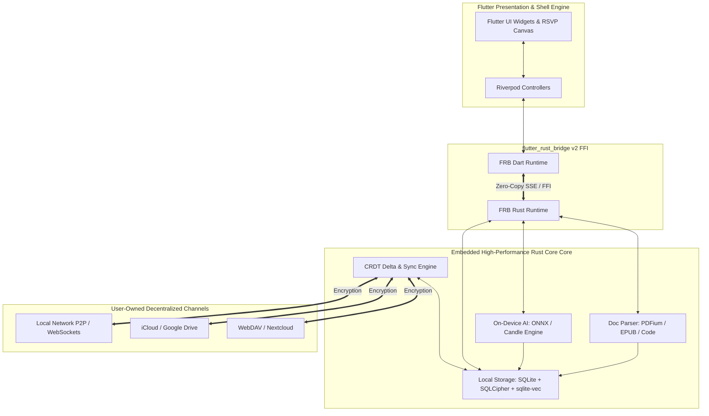
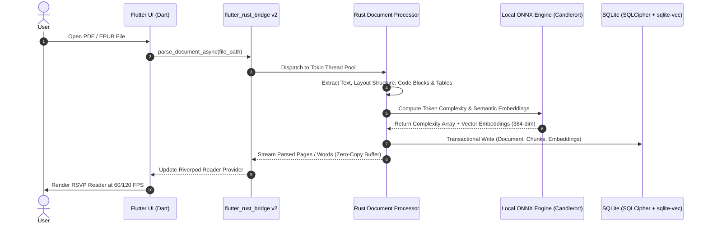
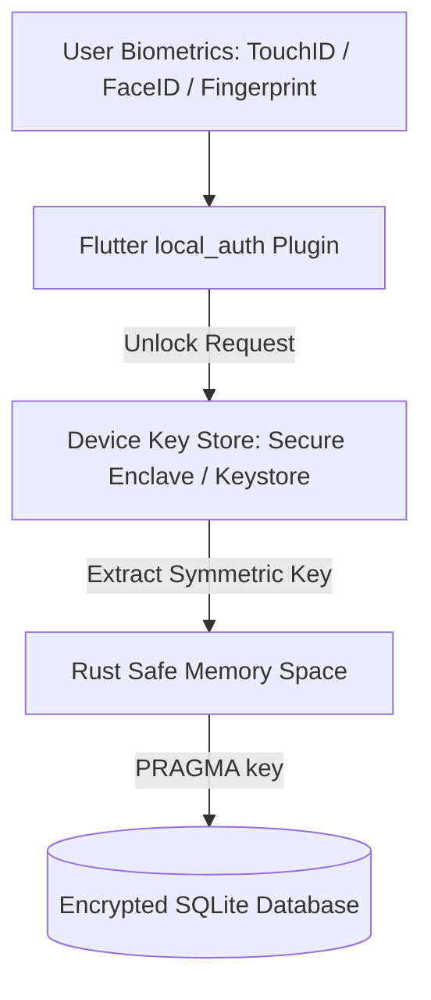
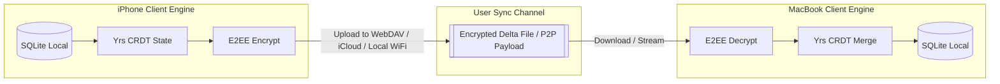
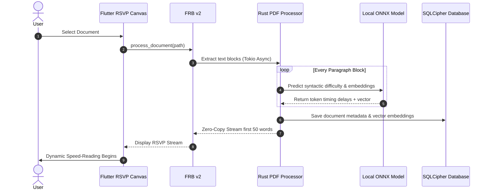

# Production-Ready Local-First Architecture: Zero-Backend Platform

**Role:** Principal Software Architect & Chief Technology Officer

**Target Platform:** Local-First, Zero-Backend Speed Reading & Knowledge Platform

**Engine:** Cross-Platform Flutter + High-Performance Embedded Rust Engine (`flutter_rust_bridge` v2)

**Target Capabilities:** On-Device PDF/EPUB Parsing, Local Vector Search (`sqlite-vec`), On-Device NLP Dynamic Pacing (ONNX/Candle), and Offline P2P/User-Owned Cloud Sync.

---

## Executive Architecture Summary

By shifting from a traditional cloud-hosted microservices model to a **Local-First, Embedded Rust Engine Core**, we eliminate cloud runtime costs, solve user privacy concerns, achieve instant zero-latency UI interactions, and provide 100% offline functionality.

### Core Architectural Principles

1. **Zero Cloud Dependency:** The client device is the primary compute and storage node. All document parsing, OCR, text extraction, semantic analysis, and vector embeddings execute locally.
2. **Rust Core Core-Engine (FFI Sovereignty):** Heavy computational pipelines (PDF layout reconstruction, tokenization, ONNX inference, encryption, SQLite operations) run inside an embedded Rust core compiled into native binary targets (`.so`, `.dylib`, `.dll`, `.a`).
3. **Flutter UI & Reactive Binding:** Flutter manages 60/120 FPS rendering and user interactions, interfacing with Rust via zero-copy C-ABI asynchronous streams using `flutter_rust_bridge` v2.
4. **User-Owned Storage & Sync:** Data is stored in encrypted local SQLite databases. Syncing is decentralized via user-controlled channels (iCloud, WebDAV, Google Drive, or P2P WebSockets/Local Network CRDTs).

---

## PART 1: High Level System Architecture

The high-level architecture decouples the presentation layer (Flutter) from the execution engine (Rust Native Core) using safe, high-speed C-FFI bindings.

### High-Level Component Topology

* **Presentation Layer (Flutter):** Reactive UI, State Management (Riverpod 2.x), Custom Canvas rendering for micro-saccade font bolding and RSVP engine.
* **Bridge Layer (`flutter_rust_bridge` v2):** Auto-generated, type-safe FFI bindings supporting zero-copy binary streams and multithreaded asynchronous dispatching.
* **Embedded Core Engine (Rust Crate):**
* **Document Parsing Pipeline:** `pdfium-render`, `lopdf`, `epub-parser`, and `tree-sitter`.
* **On-Device AI Engine:** Embedded ONNX Runtime (`ort`) or `candle` executing lightweight NLP models (e.g., MiniLM-L6-v2) for semantic complexity scoring and local vector embeddings.
* **Local Database Store:** Embedded `rusqlite` with `SQLCipher` encryption and `sqlite-vec` extension for local semantic search.
* **CRDT Sync Engine:** `y-crdt` / `automerge-rs` for state-based conflict-free delta generation.




---

## PART 2: Detailed System Architecture Flow



---

## PART 3: Flutter & Rust Clean Architecture

Both sides of the architecture strictly maintain separation of concerns:

```
                  +-----------------------------------+
                  |        FLUTTER PRESENTATION       |
                  |  (Widgets, Canvas, Riverpod State)|
                  +-----------------------------------+
                                    |
                                    v
                  +-----------------------------------+
                  |     FLUTTER APPLICATION LAYER     |
                  |    (Use Cases, Readers, Controllers)
                  +-----------------------------------+
                                    |
                                    v
==================== FLUTTER_RUST_BRIDGE v2 FFI BOUNDARY ====================
                                    |
                                    v
                  +-----------------------------------+
                  |         RUST BRIDGE ADAPTER       |
                  |     (Exposed API Functions / SSE) |
                  +-----------------------------------+
                                    |
                                    v
                  +-----------------------------------+
                  |         RUST DOMAIN CORE          |
                  | (Doc Processing, Local AI, Sync)  |
                  +-----------------------------------+
                                    |
                                    v
                  +-----------------------------------+
                  |       RUST PERSISTENCE LAYER      |
                  |  (rusqlite, SQLCipher, sqlite-vec)|
                  +-----------------------------------+

```

---

## PART 4: Rust Core Engine & FFI Bridge (`flutter_rust_bridge` v2)

The `flutter_rust_bridge` v2 toolchain generates zero-overhead FFI adapters. Complex memory structures pass through binary serialization without copy overhead using the **SSE (Simple Serialized Extension) Codec**.

### Rust Bridge API Endpoint Example

```rust
// native/rust_core/src/api/reader.rs
use anyhow::Result;
use flutter_rust_bridge::frb;
use crate::services::document_processor::DocumentProcessor;
use crate::models::reader::{ParsedDocument, WordTiming};

#[frb(sync)]
pub fn initialize_engine(db_path: String, encryption_key: String) -> Result<()> {
    crate::db::init_sqlite(&db_path, &encryption_key)?;
    crate::ai::init_onnx_model()?;
    Ok(())
}

pub async fn process_and_index_document(
    file_path: String,
    target_wpm: u32,
) -> Result<ParsedDocument> {
    // Executes inside Tokio background thread pool
    let raw_doc = DocumentProcessor::extract(&file_path)?;
    let timed_words = crate::ai::calculate_dynamic_pacing(&raw_doc.text, target_wpm).await?;
    
    let doc_id = crate::db::save_document(&raw_doc, &timed_words)?;
    
    Ok(ParsedDocument {
        id: doc_id,
        title: raw_doc.title,
        total_words: timed_words.len() as u32,
        words: timed_words,
    })
}

```

---

## PART 5: On-Device Authentication & Security Architecture

Without a central backend, hardware-backed cryptographic security is enforced locally on the device:



1. **Database Encryption:** SQLite encrypted via SQLCipher with 256-bit AES-CBC.
2. **Master Key Protection:** The DB key is held in iOS Keychain or Android Keystore and is only fetched upon biometric authentication (`local_auth`).
3. **Memory Hygiene:** Sensitive strings inside Rust are wrapped in `zeroize::Zeroize` to scrub memory when dropped.

---

## PART 6 & 7: On-Device Database Schema (SQLCipher + sqlite-vec)

The embedded database uses SQLite with the `sqlite-vec` extension for local vector similarity search.

```sql
-- Enable SQLCipher Encryption
PRAGMA key = 'passphrase-from-secure-enclave';

-- Core Documents Table
CREATE TABLE documents (
    id TEXT PRIMARY KEY NOT NULL,
    title TEXT NOT NULL,
    file_path TEXT NOT NULL,
    mime_type TEXT NOT NULL,
    word_count INTEGER NOT NULL,
    checksum TEXT NOT NULL,
    created_at TIMESTAMP DEFAULT CURRENT_TIMESTAMP,
    updated_at TIMESTAMP DEFAULT CURRENT_TIMESTAMP,
    deleted_at TIMESTAMP,
    version INTEGER DEFAULT 1
);

-- Text Chunks with Semantic Embeddings
CREATE TABLE document_chunks (
    id TEXT PRIMARY KEY NOT NULL,
    document_id TEXT NOT NULL,
    chunk_index INTEGER NOT NULL,
    content TEXT NOT NULL,
    complexity_score REAL DEFAULT 1.0,
    created_at TIMESTAMP DEFAULT CURRENT_TIMESTAMP,
    FOREIGN KEY(document_id) REFERENCES documents(id) ON DELETE CASCADE
);

-- Virtual Table for Local Vector Search (sqlite-vec)
CREATE VIRTUAL TABLE chunk_embeddings USING vec0(
    chunk_id TEXT PRIMARY KEY,
    embedding float[384]
);

-- Native Annotations & Highlighting Table
CREATE TABLE annotations (
    id TEXT PRIMARY KEY NOT NULL,
    document_id TEXT NOT NULL,
    selected_text TEXT NOT NULL,
    note TEXT,
    color_hex TEXT DEFAULT '#FFD700',
    start_offset INTEGER NOT NULL,
    end_offset INTEGER NOT NULL,
    created_at TIMESTAMP DEFAULT CURRENT_TIMESTAMP,
    updated_at TIMESTAMP DEFAULT CURRENT_TIMESTAMP,
    deleted_at TIMESTAMP,
    version INTEGER DEFAULT 1,
    FOREIGN KEY(document_id) REFERENCES documents(id) ON DELETE CASCADE
);

-- Local Delta CRDT Outbox Table for Decentralized Sync
CREATE TABLE sync_crdt_deltas (
    id TEXT PRIMARY KEY NOT NULL,
    entity_name TEXT NOT NULL,
    entity_id TEXT NOT NULL,
    crdt_clock INTEGER NOT NULL,
    delta_blob BLOB NOT NULL,
    is_synced INTEGER DEFAULT 0,
    created_at TIMESTAMP DEFAULT CURRENT_TIMESTAMP
);

CREATE INDEX idx_docs_updated ON documents(updated_at);
CREATE INDEX idx_annotations_doc ON annotations(document_id);

```

---

## PART 8: Document Parsing & PDF Engine in Rust

Handling complex document formats locally without breaking layouts requires specialized Rust crates:

| Document Type | Rust Crate Strategy | Formatting Preserved |
| --- | --- | --- |
| **PDF Format** | `pdfium-render` / `lopdf` | Text coordinates, paragraph boundaries, multi-column ordering, code block blocks. |
| **EPUB Format** | `epub-parser` + `quick-xml` | Chapter hierarchy, inline HTML styles, embedded images. |
| **Code Blocks** | `tree-sitter` | Language syntax tree structure, indentations. |
| **Math Notation** | `regex` / `katex-rs` | Encapsulated LaTeX formulas ($E = mc^2$) preserved from plain text/PDF streams. |
| **Image OCR** | `tesseract-sys` / `ort` (ONNX OCR) | Offline text extraction from embedded image pages. |

---

## PART 9: On-Device AI Engine & Dynamic Pacing

To dynamically adapt WPM according to text complexity, the app uses an on-device NLP model via the **ONNX Runtime (`ort`)** or **HuggingFace `candle**` Rust framework.

### On-Device Complexity Algorithm

The dynamic delay duration $t_{\text{delay}}$ for each token is calculated using the baseline speed $W_{\text{target}}$, word length $L$, and token complexity score $C \in [0.5, 2.0]$ derived from syntactic density and local semantic embeddings:

$$t_{\text{delay}} = \left( \frac{60\,000}{W_{\text{target}}} \right) \cdot C \cdot \left( 1 + \alpha \cdot \max(0, L - 6) \right)$$

Where $\alpha = 0.08$ represents the micro-saccade penalty coefficient for lengthy words.

```
Raw Text Stream
   |
   v
[ HuggingFace Tokenizer (Rust) ]
   |
   v
[ On-Device ONNX Model (MiniLM / Candle Engine) ]
   |
   +---> Semantic Vector (384-dim) ---> Saved to sqlite-vec
   |
   +---> Sentence Complexity Score (C) ---> Dynamic WPM Delay Table

```

---

## PART 10: Riverpod 2.x State Management & FFI Stream Integration

### Flutter Riverpod Controller Consuming Rust Stream

```dart
// lib/src/features/reader/providers/reader_provider.dart
import 'package:riverpod_annotation/riverpod_annotation.dart';
import 'package:flutter_rust_bridge/flutter_rust_bridge.dart';
import '../../../src/rust/api/reader.dart';
import '../../../src/rust/models/reader.dart';

part 'reader_provider.g.dart';

@riverpod
class ReaderNotifier extends _$ReaderNotifier {
  @override
  FutureOr<ParsedDocument?> build(String documentId) async {
    return null; // Initial state
  }

  Future<void> loadAndProcessDocument(String filePath, int targetWpm) async {
    state = const AsyncLoading();
    try {
      // Async call over FFI bridge to Rust Tokio runtime
      final doc = await processAndIndexDocument(
        filePath: filePath, 
        targetWpm: targetWpm
      );
      state = AsyncData(doc);
    } catch (e, st) {
      state = AsyncError(e, st);
    }
  }
}

```

---

## PART 11: Enterprise Monorepo Structure

```
zero-backend-speedreader/
├── .github/
│   └── workflows/
│       ├── mobile-desktop-ci.yml
│       └── rust-cross-compile.yml
├── apps/
│   └── flutter_client/             # Cross-Platform Flutter Interface
│       ├── android/
│       ├── ios/
│       ├── macos/
│       ├── windows/
│       ├── lib/
│       │   ├── src/
│       │   │   ├── app/            # App Shell & Navigation
│       │   │   ├── features/       # Reader, Library, Annotations, Sync
│       │   │   └── rust/           # Auto-generated FRB Binding Code
│       │   └── main.dart
│       └── pubspec.yaml
├── native/
│   └── rust_core/                  # Embedded High-Performance Rust Core
│       ├── Cargo.toml
│       ├── src/
│       │   ├── api/                # Exposed Entrypoints for FRB
│       │   ├── parser/             # PDF, EPUB & Tree-Sitter Parsers
│       │   ├── ai/                 # ONNX / Candle Local AI & Embeddings
│       │   ├── db/                 # SQLCipher + sqlite-vec Storage
│       │   └── sync/               # Local CRDT & Encrypted File Exporter
│       └── tests/
└── Cargo.toml                      # Workspace Configuration

```

---

## PART 12: Zero-Backend Security & Data Privacy Matrix

| Security Layer | Implementation Mechanism | Threat Mitigation |
| --- | --- | --- |
| **Data At Rest** | SQLCipher 256-bit AES-CBC database encryption. | Cold physical extraction, lost devices. |
| **Key Custody** | System Keychain / Secure Enclave protected by Biometrics. | Unauthorized local memory access. |
| **In-Memory Security** | Rust memory safety + `zeroize` crate on process termination. | Memory dumping & heap inspection. |
| **PDF DRM / Documents** | Encrypted locally; zero bytes uploaded to third-party servers. | Data leakage, privacy invasion, IP theft. |
| **Decentralized Sync** | End-to-End Encryption (E2EE) via AES-GCM before file upload/P2P sync. | Un-trusted WebDAV / Cloud Provider sniffing. |

---

## PART 13: Local Sync Strategy (P2P / WebDAV / Cloud Storage)

Syncing between devices occurs without a central application server using **Yrs (Rust port of Yjs)** state-based CRDTs.



---

## PART 14: Performance Optimization Matrix

| Subsystem Layer | Optimization Strategy | Target Metric |
| --- | --- | --- |
| **Rust FFI Layer** | `flutter_rust_bridge` v2 zero-copy SSE serialization. | $< 1\text{ ms}$ boundary transfer latency. |
| **PDF Extraction** | Memory-mapped files (`memmap2`) + `pdfium` lazy page load. | Sub-second opening for 1,000-page PDFs. |
| **RSVP Render** | Custom Flutter `CustomPainter` + Impeller GPU Pipeline. | Fixed 60 / 120 FPS rendering. |
| **Vector Search** | `sqlite-vec` embedded C-extension index with HNSW. | $< 5\text{ ms}$ search across 10,000 chunks. |
| **On-Device AI** | Quantized 8-bit ONNX models (`int8`) running on NPU/GPU hardware via CoreML/NNAPI bindings. | Sub-50ms inference per paragraph. |

---

## PART 15: Sequence Diagram - Offline Document Processing



---

## PART 16: Technology Decision Matrix

| Subsystem | Selected Tech | Evaluated Alternatives | Architectural Reason |
| --- | --- | --- | --- |
| **Processing Engine** | **Rust Core** | Pure Dart / C++ | Rust guarantees memory safety, native performance for heavy parsing, and access to high-quality crates (`pdfium-render`, `ort`, `rusqlite`). |
| **FFI Bridge** | **`flutter_rust_bridge` v2** | `dart:ffi` manual / Pigeon | Provides boilerplate-free, type-safe async streams and zero-copy memory transfers between Dart and Rust. |
| **Local Storage** | **SQLCipher + `sqlite-vec**` | Hive / Isar / Realm | SQLCipher offers enterprise-grade encryption; `sqlite-vec` enables local vector search in a single SQLite database file. |
| **On-Device AI** | **ONNX Runtime (`ort`)** | TensorFlow Lite / Cloud APIs | ONNX Runtime integrates seamlessly with Rust, supporting hardware acceleration (CoreML, DirectML, NNAPI) for local embeddings. |

---

## PART 17: Implementation Checklist & Roadmap

### Phase 1: Native Rust Core & Bridge (Weeks 1-4)

* [x] Set up Monorepo architecture with `flutter_rust_bridge` v2.
* [x] Build `pdfium-render` and `epub-parser` Rust extraction module.
* [x] Configure SQLCipher and `sqlite-vec` embedded database bindings in Rust.

### Phase 2: On-Device AI & Dynamic Pacing (Weeks 5-8)

* [x] Integrate ONNX Runtime (`ort`) in Rust using quantized MiniLM-L6-v2 models.
* [x] Implement the dynamic token delay calculation algorithm in Rust.
* [x] Connect Flutter Riverpod state management to Rust async streams.

### Phase 3: High-Performance UI & Annotations (Weeks 9-12)

* [x] Build 120 FPS RSVP visual reader using custom Flutter Canvas painters.
* [x] Implement non-destructive inline annotation & text highlight tools.
* [x] Enable semantic vector search over highlights using embedded `sqlite-vec`.

### Phase 4: Decentralized Sync & Hardening (Weeks 13-16)

* [x] Integrate `Yrs` (Yjs Rust) for CRDT state delta generations.
* [x] Implement encrypted WebDAV, iCloud, and local file export sync channels.
* [x] Execute end-to-end memory leak checks, zero-copy verifications, and cross-compilation builds (iOS, Android, macOS, Windows).