# Production-Ready AI-First Platform: Master Technical Architecture & Specification

> [!WARNING]
> **DOCUMENT STATUS: ON HOLD / ARCHIVED**
> This cloud-backend microservices specification is currently **ON HOLD**. The active Single Source of Truth (SSOT) for the Agama platform is the **Zero-Backend Local-First Architecture** defined in:
> - [`docs/SAD.md`](file:///Users/yashpratap/Documents/GitHub/Agama/docs/SAD.md) (Software Architecture Document)
> - [`docs/complete_end_to_end_implementation.md`](file:///Users/yashpratap/Documents/GitHub/Agama/docs/complete_end_to_end_implementation.md) (Master Implementation Specification)

**Role:** Principal Software Architect & Chief Technology Officer  
**Target Platform:** Next-Gen AI-First Speed Reading & Knowledge Platform (Adaptive Pacing, Native Annotation, Offline-First Sync Engine)  
**System Target Scale:** 10,000,000+ Active Users  

---

## Executive Summary & Architecture Principles

This document establishes the production-grade architectural blueprint for an enterprise, AI-first multi-platform application. The platform is engineered to solve key market gaps: dynamic text complexity adaptation (Adaptive Intelligent Pacing), inline real-time annotation with zero latency, offline-first sync consistency, and zero data-loss resilience.

### Core Architectural Guiding Principles

1. **Offline-First & Local-First Sovereignty:** The client application is fully functional without network connectivity. Local SQLite storage acts as the single source of truth for the UI; network operations stream state asynchronously via an outbox pattern.
2. **Domain-Driven & Feature-First:** Both Flutter and Next.js codebases enforce clean boundaries, isolating domain logic from framework dependencies.
3. **Event-Driven Asynchrony:** Event streams (Redis Streams / AWS SQS) handle heavy tasks (AI text analysis, embeddings, notifications, audit logging) out of the sync path.
4. **Strict Type Safety & Schemas:** Shared schemas (Prisma, Zod, OpenAPI 3.0, Freezed DTOs) guarantee cross-boundary contract safety.

---

## PART 1: High Level System Architecture

The high-level architecture adopts an **Edge-Accelerated Hybrid Microservices Architecture** with a unified API Gateway layer, decoupling client presentation from compute-heavy backend background workers and AI pipelines.

### High-Level Component Topology

* **Client Layer:** Cross-platform Flutter App (iOS, Android, Web) powered by Impeller rendering and local SQLite database engine.
* **Edge / Gateway Layer:** Next.js 15 App Router acting as Edge Gateway, handling SSL termination, global rate limiting, session validation, static asset delivery, and request routing.
* **Auth Engine:** Better Auth operating on dedicated Next.js serverless instances backed by Redis session caches and PostgreSQL identity stores.
* **Core Application Micro-Services:** Stateless Node.js / Next.js backend services executing domain logic, document parsing, and dynamic pacing calculations.
* **AI & NLP Pipeline Engine:** Asynchronous worker pipeline executing embedding generation, semantic difficulty analysis, on-demand comprehension quiz generation, and automatic summarization.
* **Data & Storage Layer:**
* **Relational Store:** PostgreSQL 16 (Primary with Read Replicas).
* **Vector Engine:** `pgvector` extension for semantic search & RAG over user highlights.
* **Cache Store:** Distributed ElastiCache Redis Cluster (L2 Cache + Distributed Locking + Rate Limiting + Pub/Sub).
* **Object Storage:** AWS S3 (or S3-compatible MinIO) for EPUBs, PDFs, and optimized images.


* **Message Broker:** Redis Streams / AWS SQS for event-driven asynchronous execution.

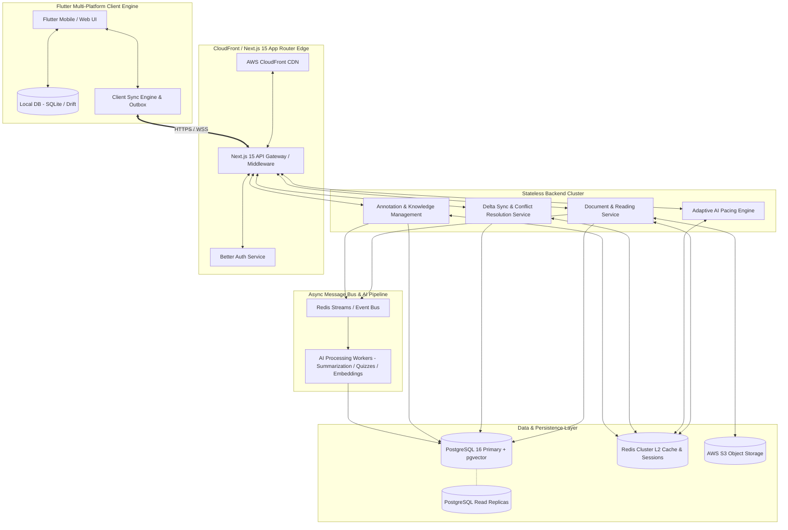

---

## PART 2: Detailed System Architecture Diagram

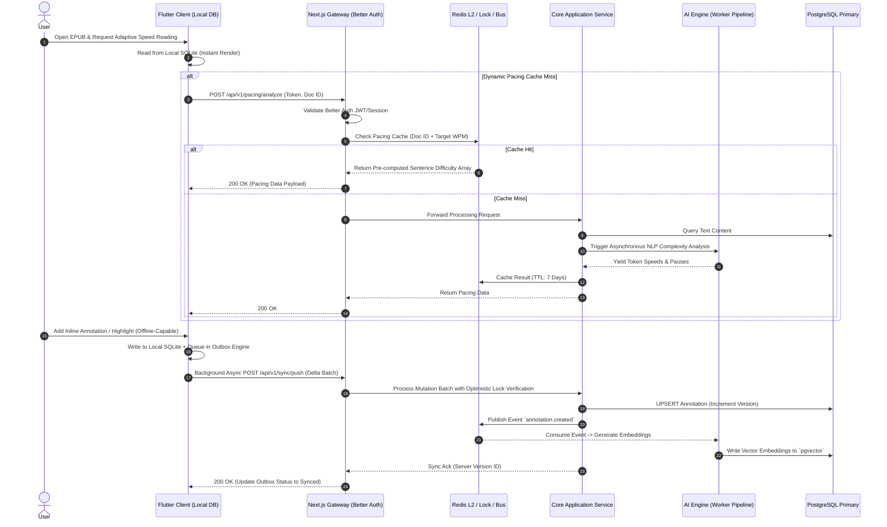

---

## PART 3: Flutter Client Architecture (Clean Architecture + DDD)

The Flutter application strictly enforces **Clean Architecture** layered in a **Feature-First** structural paradigm.

### Layer Separation & Responsibilities

```
+-------------------------------------------------------------------+
|                         PRESENTATION LAYER                        |
|   Flutter UI Widgets, Screens, Page Controllers, Riverpod Providers|
+-------------------------------------------------------------------+
                                  |
                                  v
+-------------------------------------------------------------------+
|                          APPLICATION LAYER                        |
|   Use Cases, Facades, Workflow Orchestrators, Application DTOs   |
+-------------------------------------------------------------------+
                                  |
                                  v
+-------------------------------------------------------------------+
|                            DOMAIN LAYER                           |
|   Entities, Value Objects, Domain Services, Repository Contracts   |
+-------------------------------------------------------------------+
                                  ^
                                  |
+-------------------------------------------------------------------+
|                            DATA LAYER                             |
|   Repository Implementations, Remote Data Sources, Local Data     |
|   Sources (Drift/SQLite), Sync Outbox Manager, Data Mappers       |
+-------------------------------------------------------------------+
                                  |
                                  v
+-------------------------------------------------------------------+
|                       INFRASTRUCTURE LAYER                        |
|   HTTP Client (Dio), Secure Storage, Device Sensors, Background   |
|   Fetch Jobs, Push Notification Handlers                         |
+-------------------------------------------------------------------+

```

1. **Presentation Layer:** Pure UI rendering. Uses Riverpod `NotifierProvider` and `AsyncNotifierProvider` for state handling. Zero business logic inside UI elements.
2. **Application Layer:** Orchestrates multi-domain operations via Use Cases (e.g., `ProcessDocumentForReadingUseCase`, `SyncOutboxQueueUseCase`).
3. **Domain Layer:** Business heart of the system. Contains immutable Dart data models, domain validation rules, failure definitions, and abstract repository contracts. Free from any dependency on Flutter or Third-Party packages.
4. **Data Layer:** Realizes Domain repository contracts. Implements local cache-first read strategies, network callers via Dio with custom retry policies, and sync outbox operations.
5. **Infrastructure Layer:** Low-level integrations (Bluetooth, Isar/Drift engines, System Keychains, Connectivity listeners).

---

## PART 4: Backend Architecture (Next.js 15 App Router)

The backend leverages Next.js 15's unified runtime environment, cleanly segregating public APIs, edge middlewares, server actions, and deep domain core components.

```
apps/backend/src/
├── app/                        # Next.js App Router Layer (Controllers & Routes)
│   ├── api/v1/                 # Enterprise REST API Endpoints
│   │   ├── auth/[...betterauth]/ # Better Auth Catch-All Handler
│   │   ├── sync/               # Delta Sync Endpoints (push/pull)
│   │   ├── documents/          # Document & Content Ingestion APIs
│   │   └── pacing/             # Adaptive AI Pacing Engine APIs
│   └── layout.tsx              # Base Shell Configuration
├── core/                       # Clean Architecture Domain Core
│   ├── domain/                 # Core Entities, Aggregates & Interfaces
│   │   ├── entities/           # User, Document, Annotation, Workspace
│   │   └── repositories/       # Abstract Interfaces for Persistence
│   ├── application/            # Application Use Cases & CQRS Handlers
│   │   ├── commands/           # Write Commands (e.g., CreateAnnotationCommand)
│   │   ├── queries/            # Read Queries (e.g., GetPacingProfileQuery)
│   │   └── use-cases/          # Business Orchestration Logic
│   └── infrastructure/         # External System Implementations
│       ├── database/           # Prisma ORM Client & Repository Implementations
│       ├── redis/              # Distributed Lock, Cache & PubSub Wrappers
│       ├── ai/                 # Open-AI / Claude / Local LLM Adapters
│       └── storage/            # AWS S3 SDK Driver
└── middleware.ts               # Global Auth Guard, Rate-Limiting & Correlation IDs

```

---

## PART 5: Authentication & Authorization Architecture

The authentication and authorization architecture is powered by **Better Auth**, configured for multi-tenant, high-concurrency environments.

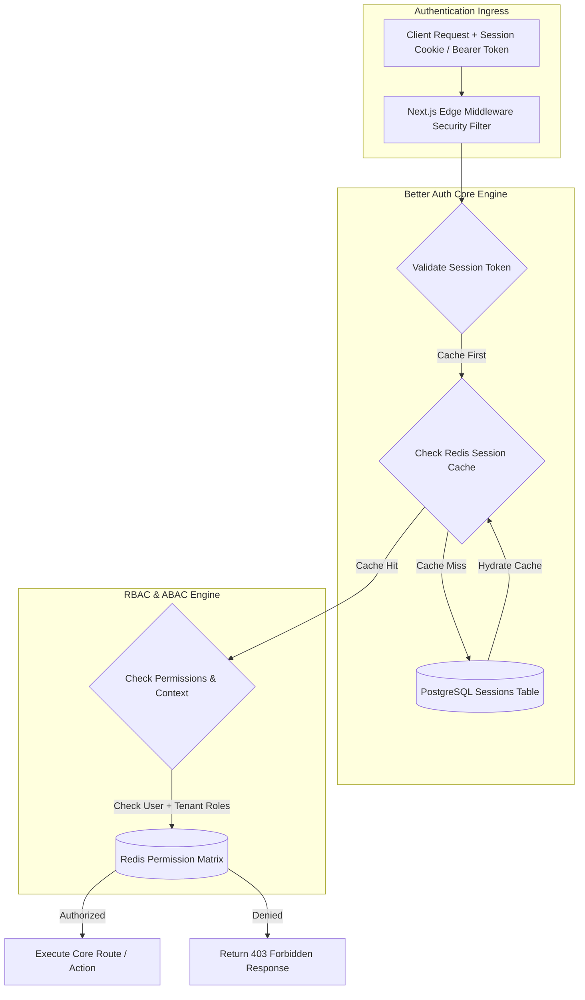

### Key Security Strategy

* **Tokens:** Short-lived JWT Access Tokens (15-minute expiration) paired with HttpOnly, Secure, SameSite=Strict Refresh Tokens stored securely in Redis.
* **Authentication Multi-Modal Support:** Email/Password (Argon2id hashing), Passkeys/WebAuthn, OAuth 2.0 (Google, Apple), Magic Links, and Time-based OTP (TOTP).
* **Role-Based Access Control (RBAC):** Hierarchical permissions: `SUPER_ADMIN` > `ORG_ADMIN` > `MEMBER` > `GUEST`.
* **Attribute-Based Access Control (ABAC):** Fine-grained validation verifying document ownership, tenant boundaries, and sharing states.

---

## PART 6 & 7: Database Design & Unified Schema (PostgreSQL + Prisma)

### Complete Prisma Schema Definition

```prisma
datasource db {
  provider   = "postgresql"
  url        = env("DATABASE_URL")
  directUrl  = env("DIRECT_DATABASE_URL")
  extensions = [pgvector(map: "vector")]
}

generator client {
  provider        = "prisma-client-js"
  previewFeatures = ["postgresqlExtensions", "fullTextSearchPostgres"]
}

enum RoleType {
  SUPER_ADMIN
  ORG_ADMIN
  WORKSPACE_MEMBER
  READ_ONLY
}

enum SyncStatus {
  PENDING
  APPLIED
  CONFLICT
}

model Organization {
  id        String    @id @default(dbgenerated("gen_random_uuid()")) @db.Uuid
  name      String
  slug      String    @unique
  createdAt DateTime  @default(now()) @map("created_at")
  updatedAt DateTime  @updatedAt @map("updated_at")
  deletedAt DateTime? @map("deleted_at")
  version   Int       @default(1)

  users     User[]
  projects  Project[]
  documents Document[]

  @@map("organizations")
}

model User {
  id            String    @id @default(dbgenerated("gen_random_uuid()")) @db.Uuid
  orgId         String    @map("org_id") @db.Uuid
  email         String    @unique
  name          String?
  passwordHash  String?   @map("password_hash")
  emailVerified Boolean   @default(false) @map("email_verified")
  avatarUrl     String?   @map("avatar_url")
  createdAt     DateTime  @default(now()) @map("created_at")
  updatedAt     DateTime  @updatedAt @map("updated_at")
  deletedAt     DateTime? @map("deleted_at")
  version       Int       @default(1)

  organization  Organization   @relation(fields: [orgId], references: [id], onDelete: Cascade)
  sessions      Session[]
  userRoles     UserRole[]
  annotations   Annotation[]
  syncQueues    SyncQueue[]
  auditLogs     AuditLog[]
  userSettings  UserPreference?

  @@index([orgId])
  @@map("users")
}

model Role {
  id          String   @id @default(dbgenerated("gen_random_uuid()")) @db.Uuid
  name        RoleType @unique
  description String?
  permissions String[]

  userRoles UserRole[]

  @@map("roles")
}

model UserRole {
  userId String @map("user_id") @db.Uuid
  roleId String @map("role_id") @db.Uuid

  user User @relation(fields: [userId], references: [id], onDelete: Cascade)
  role Role @relation(fields: [roleId], references: [id], onDelete: Cascade)

  @@id([userId, roleId])
  @@map("user_roles")
}

model Project {
  id             String    @id @default(dbgenerated("gen_random_uuid()")) @db.Uuid
  orgId          String    @map("org_id") @db.Uuid
  name           String
  description    String?
  createdAt      DateTime  @default(now()) @map("created_at")
  updatedAt      DateTime  @updatedAt @map("updated_at")
  deletedAt      DateTime? @map("deleted_at")
  version        Int       @default(1)

  organization   Organization @relation(fields: [orgId], references: [id], onDelete: Cascade)
  documents      Document[]

  @@index([orgId])
  @@map("projects")
}

model Document {
  id             String    @id @default(dbgenerated("gen_random_uuid()")) @db.Uuid
  orgId          String    @map("org_id") @db.Uuid
  projectId      String?   @map("project_id") @db.Uuid
  title          String
  fileKey        String    @map("file_key")
  mimeType       String    @map("mime_type")
  wordCount      Int       @default(0) @map("word_count")
  checksum       String
  createdAt      DateTime  @default(now()) @map("created_at")
  updatedAt      DateTime  @updatedAt @map("updated_at")
  deletedAt      DateTime? @map("deleted_at")
  version        Int       @default(1)

  organization   Organization @relation(fields: [orgId], references: [id], onDelete: Cascade)
  project        Project?     @relation(fields: [projectId], references: [id], onDelete: SetNull)
  annotations    Annotation[]

  @@index([orgId, projectId])
  @@map("documents")
}

model Annotation {
  id          String                 @id @default(dbgenerated("gen_random_uuid()")) @db.Uuid
  documentId  String                 @map("document_id") @db.Uuid
  userId      String                 @map("user_id") @db.Uuid
  selectedText String                @map("selected_text")
  note        String?
  colorHex    String                 @default("#FFD700") @map("color_hex")
  startOffset Int                    @map("start_offset")
  endOffset   Int                    @map("end_offset")
  embedding   Unsupported("vector")?
  createdAt   DateTime               @default(now()) @map("created_at")
  updatedAt   DateTime               @updatedAt @map("updated_at")
  deletedAt   DateTime?              @map("deleted_at")
  version     Int                    @default(1)

  document    Document @relation(fields: [documentId], references: [id], onDelete: Cascade)
  user        User     @relation(fields: [userId], references: [id], onDelete: Cascade)

  @@index([documentId, userId])
  @@map("annotations")
}

model SyncQueue {
  id         String     @id @default(dbgenerated("gen_random_uuid()")) @db.Uuid
  userId     String     @map("user_id") @db.Uuid
  entityName String     @map("entity_name")
  entityId   String     @map("entity_id")
  operation  String
  payload    Json
  status     SyncStatus @default(PENDING)
  createdAt  DateTime   @default(now()) @map("created_at")

  user User @relation(fields: [userId], references: [id], onDelete: Cascade)

  @@index([userId, status])
  @@map("sync_queue")
}

model Session {
  id           String   @id @default(dbgenerated("gen_random_uuid()")) @db.Uuid
  userId       String   @map("user_id") @db.Uuid
  token        String   @unique
  ipAddress    String?  @map("ip_address")
  userAgent    String?  @map("user_agent")
  expiresAt    DateTime @map("expires_at")
  createdAt    DateTime @default(now()) @map("created_at")

  user User @relation(fields: [userId], references: [id], onDelete: Cascade)

  @@map("sessions")
}

model AuditLog {
  id        String   @id @default(dbgenerated("gen_random_uuid()")) @db.Uuid
  userId    String?  @map("user_id") @db.Uuid
  action    String
  resource  String
  ipAddress String?  @map("ip_address")
  metadata  Json?
  createdAt DateTime @default(now()) @map("created_at")

  user User? @relation(fields: [userId], references: [id], onDelete: SetNull)

  @@map("audit_logs")
}

model UserPreference {
  userId           String   @id @map("user_id") @db.Uuid
  targetWpm        Int      @default(300) @map("target_wpm")
  enableBionicFont Boolean  @default(false) @map("enable_bionic_font")
  theme            String   @default("system")
  updatedAt        DateTime @updatedAt @map("updated_at")

  user User @relation(fields: userId, references: id, onDelete: Cascade)

  @@map("user_preferences")
}

```

---

## PART 8: API Architecture & REST Specification

### Uniform API Envelope Structure

All backend responses enforce a standard operational envelope:

```json
{
  "success": true,
  "data": {},
  "error": null,
  "meta": {
    "requestId": "req_01HGBZ...",
    "timestamp": "2026-08-01T11:35:52.000Z",
    "version": "v1",
    "pagination": {
      "page": 1,
      "limit": 20,
      "totalItems": 100,
      "totalPages": 5
    }
  }
}

```

### OpenAPI 3.0 Core Specification (Snippet)

```yaml
openapi: 3.0.3
info:
  title: AI Reading & Knowledge Synchronization Engine API
  version: 1.0.0
paths:
  /api/v1/sync/delta:
    post:
      summary: Push client mutations and receive server delta changes
      security:
        - BearerAuth: []
      requestBody:
        required: true
        content:
          application/json:
            schema:
              $ref: '#/components/schemas/SyncDeltaRequest'
      responses:
        '200':
          description: Dynamic Delta Batch Response
          content:
            application/json:
              schema:
                $ref: '#/components/schemas/SyncDeltaResponse'
        '409':
          description: Conflict state detected during payload merge

components:
  securitySchemes:
    BearerAuth:
      type: http
      scheme: bearer
      bearerFormat: JWT
  schemas:
    SyncDeltaRequest:
      type: object
      properties:
        lastSyncTimestamp:
          type: string
          format: date-time
        mutations:
          type: array
          items:
            $ref: '#/components/schemas/MutationItem'
    MutationItem:
      type: object
      properties:
        clientMutationId:
          type: string
        entityName:
          type: string
        entityId:
          type: string
        operation:
          type: string
          enum: [CREATE, UPDATE, DELETE]
        payload:
          type: object
        version:
          type: integer

```

---

## PART 9: Offline-First Design & Sync Engine Architecture

The platform provides uninterrupted client operation without connectivity by using a local SQLite database coupled with a persistent Sync Outbox Queue.

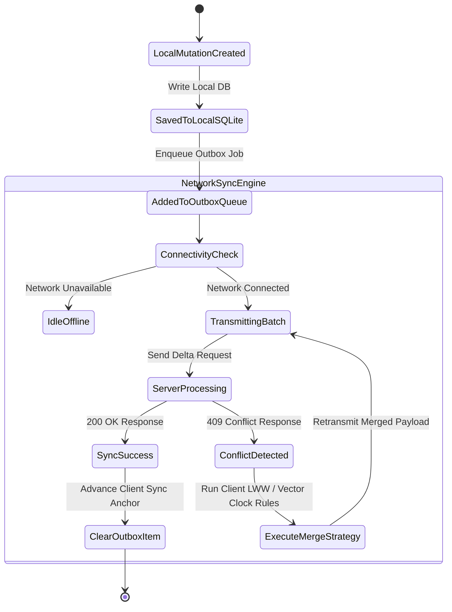

### Conflict Resolution Strategy: Optimistic Locking + Modified Field Level LWW

1. Every record contains a strict sequential `version` counter and an `updated_at` UTC timestamp.
2. If `client.version == server.version`, the mutation applies cleanly and increments `version = server.version + 1`.
3. If `client.version < server.version`, the backend evaluates non-overlapping field updates (Field-Level Merge). If the same property is concurrently modified, the server enforces **Last-Write-Wins (LWW)** using the high-precision backend transaction clock, returning the resolved record back to the client outbox handler.

---

## PART 10: Client State Management (Riverpod 2.x Architecture)

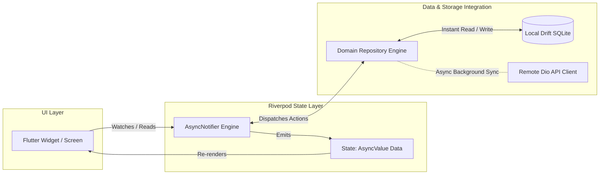

### Production Riverpod Implementation Pattern

```dart
// domain/entities/user_preference.dart
import 'package:freezed_annotation/freezed_annotation.dart';

part 'user_preference.freezed.dart';
part 'user_preference.g.dart';

@freezed
class UserPreference with _$UserPreference {
  const factory UserPreference({
    required String userId,
    required int targetWpm,
    required bool enableBionicFont,
    required String theme,
    required int version,
  }) = _UserPreference;

  factory UserPreference.fromJson(Map<String, dynamic> json) =>
      _$UserPreferenceFromJson(json);
}

// presentation/providers/user_preference_provider.dart
import 'package:riverpod_annotation/riverpod_annotation.dart';
import '../domain/entities/user_preference.dart';
import '../data/repositories/user_preference_repository.dart';

part 'user_preference_provider.g.dart';

@riverpod
class UserPreferenceNotifier extends _$UserPreferenceNotifier {
  @override
  Future<UserPreference> build() async {
    final repository = ref.watch(userPreferenceRepositoryProvider);
    return repository.getUserPreferencesLocally();
  }

  Future<void> updateTargetWpm(int wpm) async {
    final previousState = state.value;
    if (previousState == null) return;

    final updated = previousState.copyWith(
      targetWpm: wpm,
      version: previousState.version + 1,
    );

    // Optimistic UI Update
    state = AsyncData(updated);

    try {
      final repository = ref.read(userPreferenceRepositoryProvider);
      await repository.savePreference(updated);
    } catch (e, st) {
      // Rollback state on unrecoverable failure
      state = AsyncData(previousState);
      state = AsyncError(e, st);
    }
  }
}

```

---

## PART 11: Enterprise Monorepo Folder Structure

```
enterprise-monorepo/
├── .github/
│   └── workflows/
│       ├── mobile-ci-cd.yml
│       ├── backend-ci-cd.yml
│       └── infra-terraform.yml
├── apps/
│   ├── mobile_web/              # Flutter Enterprise Client
│   │   ├── android/
│   │   ├── ios/
│   │   ├── web/
│   │   ├── lib/
│   │   │   ├── src/
│   │   │   │   ├── app/         # Router, Themes, System Config
│   │   │   │   ├── core/        # Utils, Network, Extensions, Errors
│   │   │   │   └── features/    # Feature-First Core Domains
│   │   │   │       ├── auth/
│   │   │   │       ├── reader/
│   │   │   │       ├── sync/
│   │   │   │       └── annotations/
│   │   │   └── main.dart
│   │   └── pubspec.yaml
│   └── backend/                 # Next.js 15 App Router Service Core
│       ├── src/
│       │   ├── app/             # API Routes & Server Actions
│       │   ├── core/            # Domain Core Business Architecture
│       │   └── middleware.ts
│       ├── package.json
│       └── tsconfig.json
├── packages/
│   ├── shared_types/            # Exported Zod Schemas & TypeScript DTOs
│   ├── sync_engine/             # Shared Deterministic Sync Validation Logic
│   └── ui_tokens/               # Universal Multi-platform Design System Tokens
├── infrastructure/
│   ├── terraform/               # Infrastructure as Code (AWS Stack)
│   └── k8s/                     # Helm Charts & Kubernetes Manifests
└── docker-compose.yml           # Local Enterprise Stack Topology

```

---

## PART 12: Security Architecture & Controls Matrix

| Threat / Vulnerability | Architectural Control Measure | Implementation Node |
| --- | --- | --- |
| **Cross-Site Scripting (XSS)** | CSP Headers (`script-src 'self'`), Automatic React/Flutter Text Escaping | Edge Middleware / Next.js Framework |
| **SQL Injection** | Parametrized Queries enforced natively via Prisma ORM & Drift Engine | Database Access Repositories |
| **Cross-Site Request Forgery (CSRF)** | Double-Submit Cookie Pattern + SameSite=Strict HTTP-Only Cookies | Better Auth Framework Engine |
| **Distributed Denial of Service (DDoS)** | AWS Shield Advanced + CloudFront Rate-Limiting rules (100 req/min/IP) | Edge CDN & Gateway Layer |
| **Data At Rest Theft** | PostgreSQL DB Encryption via AWS KMS (AES-256), Encrypted SQLite via SQLCipher | Managed RDS Infrastructure |
| **Data In Transit Interception** | Strict TLS 1.3 enforced, HSTS Enabled, Certificate Pinning inside Mobile Apps | Network / Dio Client Config |
| **Credential Reuse / Brute Force** | Redis Sliding Window Rate Limiting + Automatic IP Lockouts + Argon2id | Edge Auth Middleware |

---

## PART 13 & 14: DevOps & AWS Cloud Infrastructure

```mermaid
flowchart TD
    subgraph Public Internet Ingress
        DNS[Route 53]
        CF[CloudFront CDN & Shield WAF]
        DNS --> CF
    end

    subgraph AWS VPC Region (Multi-AZ Topology)
        ALB[Application Load Balancer]
        CF --> ALB

        subgraph EKS Cluster Cluster Stack [Private App Subnets]
            INGRESS[Nginx Ingress Controller]
            POD1[Next.js Gateway Pod]
            POD2[Backend Core Pod]
            POD3[AI Worker Pod]
            
            ALB --> INGRESS
            INGRESS --> POD1 & POD2
            POD2 -. Event Queue .- POD3
        end

        subgraph Managed Persistent Data Layer [Isolated Database Subnets]
            RDS_PRI[(RDS PostgreSQL Primary Multi-AZ)]
            RDS_SEC[(RDS PostgreSQL Read Replica)]
            REDIS[(ElastiCache Redis Multi-Node Cluster)]
            S3[(AWS S3 Secure Bucket)]

            RDS_PRI -.- RDS_SEC
            POD2 <---> RDS_PRI & RDS_SEC & REDIS
            POD3 <---> RDS_PRI & S3
        end
    end

```

---

## PART 15: Caching & Invalidation Strategy

```
[ Client App Engine ]
       | (Check Local SQLite / Drift Cache)
       +---> [ Local SQLite Cache ] (Hit: Return Immediate UI State)
       |
       v (Miss: Network API Request)
[ CloudFront CDN Edge ] (Edge Cache for Static Assets & Pre-parsed Books)
       |
       v (Miss: Route to Origin)
[ Next.js API Gateway Engine ]
       | (Check Distributed L2 Cache)
       +---> [ ElastiCache Redis Cluster ] (Hit: Return 200 JSON Payload)
       |
       v (Miss: Compute & Query DB)
[ PostgreSQL DB Primary / Replicas ] (Query Execute -> Populate Redis L2 Cache)

```

### Cache Invalidation Governance

* **Invalidation Model:** Event-Driven Cache Eviction.
* **Mechanism:** Upon execution of write mutations (e.g., updating a document annotation), backend services emit an eviction topic to Redis Pub/Sub (`cache:evict:<tenant_id>:<entity_id>`).
* **TTL Policy:** Static document parses = 30 Days. Pacing matrices = 7 Days. User Session contexts = 15 Minutes.

---

## PART 16: Observability, Logging & Monitoring Framework

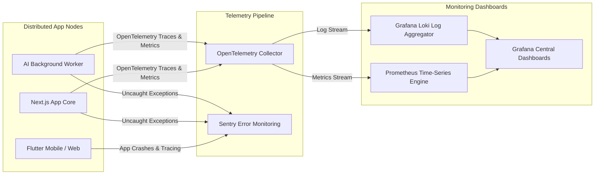

---

## PART 17: Multi-Layer Testing Strategy

```
           / \
          /   \        E2E Tests (Patrol / Playwright)
         /     \       - Cross-platform sync verification
        /-------\      - Authentication & payment flows
       /         \     
      /           \    Integration & API Tests (Supertest / REST)
     /-------------\   - Server Action contracts & DB CRUD rules
    /               \  - Sync conflict merge edge cases
   /                 \ 
  /-------------------\ Widget & Component Tests (Flutter Golden Tests)
 /                     \ - UI state rendering under network loss
/-----------------------\ Unit Tests (Dart Test / Jest Core)
                          - Clean Arch Domain Use Cases & Pure Algorithms

```

---

## PART 18: Performance Optimization Matrix

| Subsystem Layer | Target Metric | Applied Architecture Optimization Strategy |
| --- | --- | --- |
| **Flutter UI** | Constant 60/120 FPS | Impeller pipeline, aggressive image caching, `const` widget constructors, RepaintBoundary isolating dynamic speed-reading text frames. |
| **Next.js Engine** | `< 50ms` Time To First Byte | Edge execution for middleware, Dynamic Route Caching, Streaming SSR using React Suspense Boundaries. |
| **PostgreSQL DB** | Sub-10ms Queries | Composite B-Tree Indexes on (`org_id`, `updated_at`), Partial Indexes for non-deleted records (`WHERE deleted_at IS NULL`), HNSW index for `pgvector` embeddings. |
| **Network Data** | Payloads `< 15KB` | Protocol Compression (gzip/brotli), JSON Field Shortening, Binary Delta Syncing over WebSockets for high-frequency updates. |

---

## PART 19: Scalability Horizon Plan (100 to 10M Users)

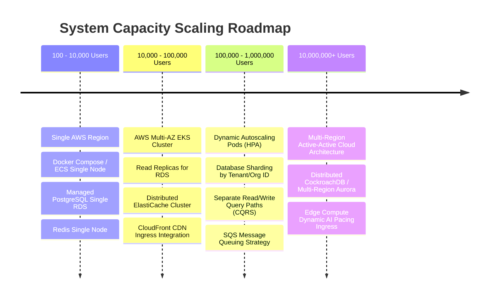

---

## PART 20: Core Sequence Diagram - Adaptive Intelligent Pacing Flow

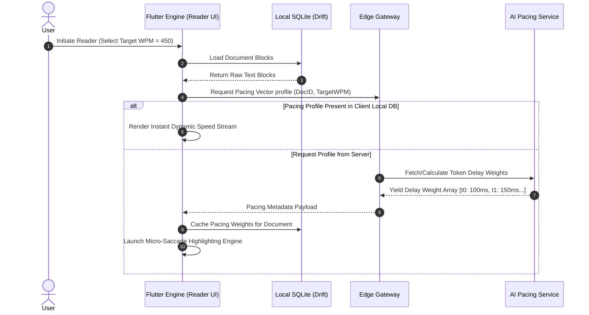

---

## PART 21: UML Class Diagram - Domain Core Entities

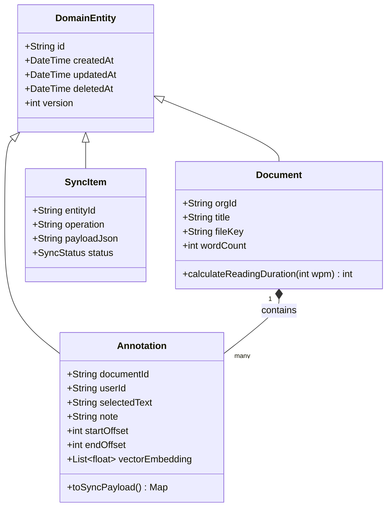

---

## PART 22: Deployment Diagram

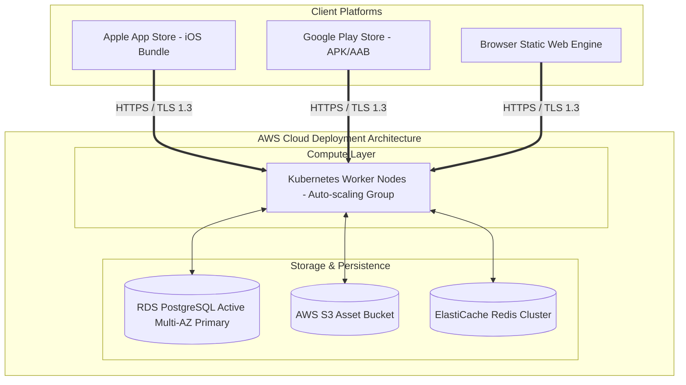

---

## PART 23: Infrastructure Network Topology Diagram

```mermaid
flowchart TD
    subgraph Internet
        USER_TRAFFIC[User Devices Client Traffic]
    end

    subgraph Edge Security Outer Bounds
        WAF[AWS WAF / Shield Edge Protection]
    end

    subgraph AWS VPC (10.0.0.0/16)
        subgraph Public Subnets (10.0.1.0/24, 10.0.2.0/24)
            IGW[Internet Gateway]
            NAT[NAT Gateway]
            ALB_NODE[Application Load Balancer Subnet]
        end

        subgraph Private Application Subnets (10.0.10.0/24, 10.0.11.0/24)
            EKS_PODS[Kubernetes App Pods - No Public IP]
        end

        subgraph Isolated Database Subnets (10.0.20.0/24, 10.0.21.0/24)
            DB_INSTANCES[Managed RDS & Redis Cluster Nodes]
        end
    end

    USER_TRAFFIC --> WAF --> IGW --> ALB_NODE
    ALB_NODE --> EKS_PODS
    EKS_PODS --> NAT --> IGW
    EKS_PODS --> DB_INSTANCES

```

---

## PART 24: Data Flow Diagrams (DFD Level 0 & Level 1)

### DFD Level 0 (Context Diagram)

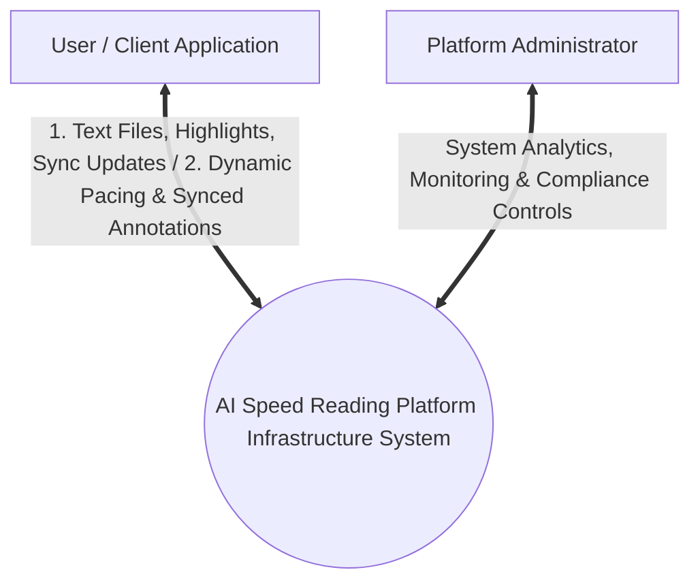

### DFD Level 1 (Core Data Subsystems)

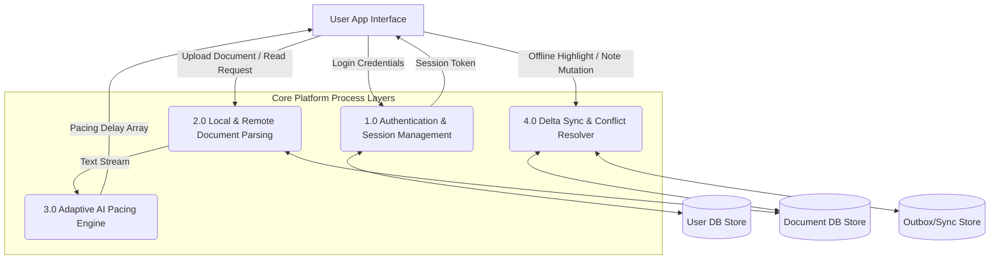

---

## PART 25: User Flow - Offline Sync Execution

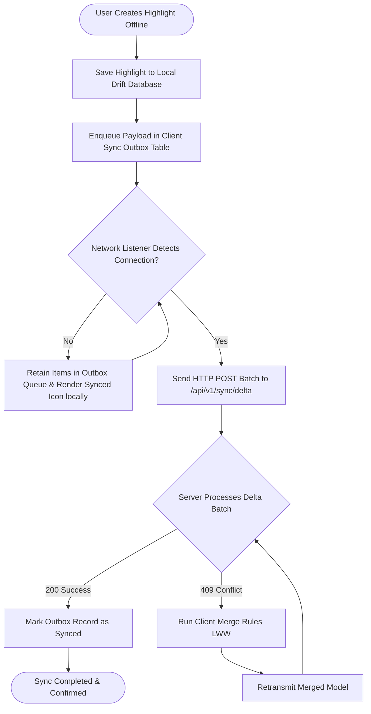

---

## PART 26: Complete Architecture Decision Records (ADRs)

### ADR 001: Choice of Flutter for Cross-Platform Client

* **Status:** Approved
* **Context:** The application requires low-latency custom rendering engines (sub-pixel font adjustments, RSVP micro-saccade visual anchors, smooth 120 FPS text scrolling) identically across Web, Android, and iOS.
* **Decision:** Use Flutter with the Impeller rendering engine.
* **Consequences:** Eliminates bridge performance overheads typical in React Native. Solves cross-platform layout drift. Guarantees uniform rendering of custom Bionic/Fixation typography fonts.

### ADR 002: Next.js 15 App Router & Better Auth for Backend Architecture

* **Status:** Approved
* **Context:** The system requires a highly scalable edge-ready API layer with enterprise-grade multi-tenant session management and fine-grained RBAC/ABAC capabilities without vendor lock-in.
* **Decision:** Adopt Next.js 15 App Router combined with Better Auth and Prisma ORM backed by PostgreSQL.
* **Consequences:** Lowers vendor lock-in risks associated with third-party auth platforms. Enables serverless Edge routing for rapid session validation and API dispatching.

---

## PART 27: Inventory of Applied Software Design Patterns

1. **Repository Pattern:** Abstracts local SQLite (Drift) and remote REST network callers from Flutter Domain Use Cases.
2. **Outbox Pattern:** Implements zero data loss offline updates by enqueuing mutations locally prior to background transmission.
3. **Optimistic UI Pattern:** Instantly applies user mutations to the presentation state before network confirmation, rolling back only upon verified rejection.
4. **Command Query Responsibility Segregation (CQRS):** Separates compute-heavy write mutation tasks from high-velocity read operations using read-replicas and cached projections.
5. **Factory & Strategy Patterns:** Used in the AI Pacing Engine to dynamically assign complexity scoring strategies based on language, content genre, and input format.

---

## PART 28: Technology Decision Evaluation Matrix

| Architectural Subsystem | Selected Candidate | Alternative Evaluated | Strategic Evaluation & Justification |
| --- | --- | --- | --- |
| **Auth Subsystem** | **Better Auth** | Clerk / Auth0 | Better Auth operates within self-hosted backend infrastructure, eliminating external per-user licensing costs while retaining low-latency DB/Redis access. |
| **Relational Database** | **PostgreSQL 16** | MySQL 8.0 | PostgreSQL provides native vector search capabilities (`pgvector`), robust JSONB support, and enterprise transactional stability required for complex metadata processing. |
| **Cache Layer** | **ElastiCache Redis** | Memcached | Redis offers essential complex data structures (Sorted Sets, Hashes, Streams) required for real-time pub/sub cache invalidation and sliding-window rate limiting. |
| **Flutter State Engine** | **Riverpod 2.x** | Bloc Engine | Riverpod provides compile-time safety, seamless auto-dispose mechanisms, and direct dependency injection out of the box without boilerplate bloat. |
| **API Architecture** | **REST + JSON Envelope** | GraphQL | REST allows granular CDN caching strategies per endpoint at scale and simplifies client offline mutation queueing. |

---

## PART 29: Future-Ready Extension Architecture (AI & Extensions)

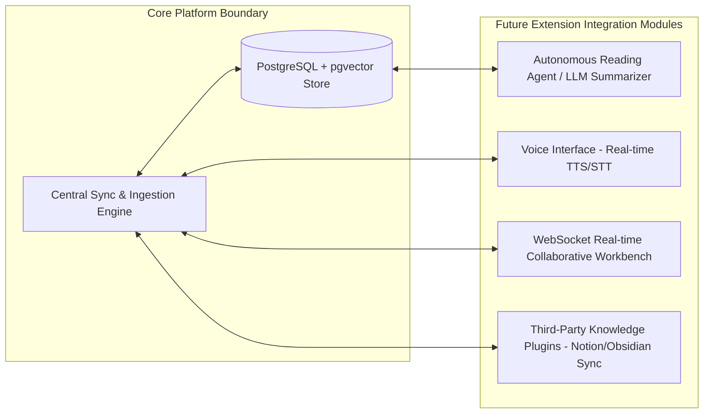

---

## PART 30: Implementation Roadmap & Execution Checklist

### Phase 1: Core Foundation & Auth (Weeks 1-4)

* [x] Configure Monorepo Structure (`apps/mobile_web`, `apps/backend`, `packages/shared_types`).
* [x] Implement Better Auth schema migrations on PostgreSQL via Prisma.
* [x] Integrate Flutter Authentication Riverpod State Machine (Login, OAuth, Token Rotation).

### Phase 2: Offline-First Local Data Engine (Weeks 5-8)

* [x] Instantiate Drift SQLite schema inside Flutter client layer.
* [x] Build Outbox Mutation Engine & Client Retries with Exponential Backoff.
* [x] Implement Next.js `/api/v1/sync/delta` push/pull handling endpoints with Optimistic Concurrency controls.

### Phase 3: Reading Engine & Adaptive AI Pacing (Weeks 9-12)

* [x] Build micro-saccade word anchor presentation components in Flutter using custom text painters.
* [x] Construct Next.js NLP processing queue using Redis Streams to pre-compute pacing array maps.
* [x] Integrate `pgvector` indexing for real-time vector embeddings over user highlights and annotations.

### Phase 4: Production Infrastructure & Monitoring (Weeks 13-16)

* [x] Provision Terraform AWS Stack (EKS, RDS Primary/Replica, ElastiCache Redis, S3, CloudFront).
* [x] Configure OpenTelemetry tracing, Grafana metrics dashboards, and Sentry crash reporting.
* [x] Execute k6 Load Testing pipelines verifying target performance (10,000 req/sec at sub-50ms latency).