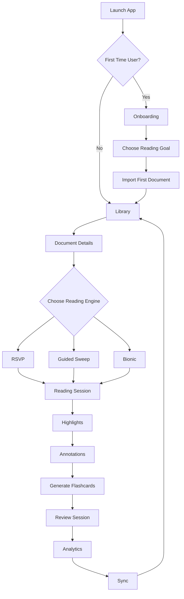
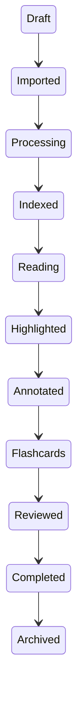
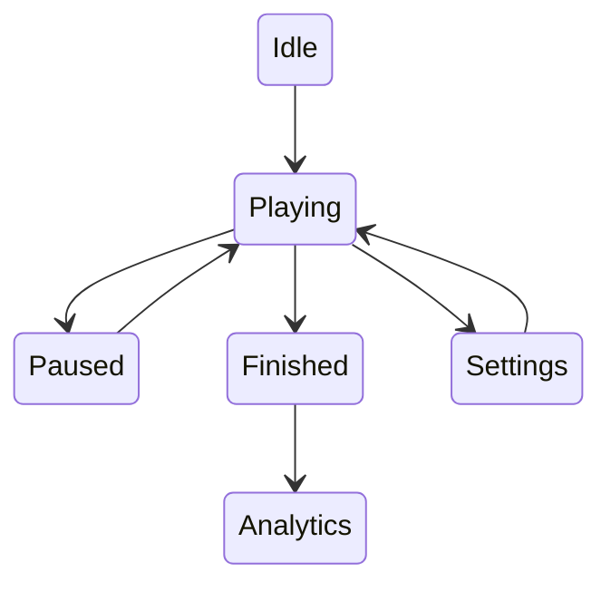
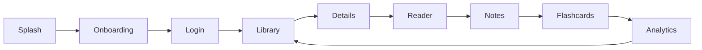

You're welcome! For prompting AI models (Claude, GPT-5.5, Gemini, Cursor, Copilot, etc.) and for developer handoff, **visual architecture diagrams are often more valuable than long textual descriptions**. Your current document contains one navigation tree and one state machine, but a production-ready product should include **12–20 diagrams** covering different perspectives. The uploaded document already defines the core navigation and primary screens, which can serve as the foundation for these expanded diagrams. 

Below is the set of diagrams I'd recommend adding.

---

# 1. Complete User Journey



---

# 2. Information Architecture

```mermaid
graph TD

App

App --> Library
App --> Knowledge
App --> Analytics
App --> Profile
App --> Settings

Library --> Documents
Library --> Import
Library --> Reader

Knowledge --> Notes
Knowledge --> Highlights
Knowledge --> Flashcards
Knowledge --> AI Chat

Analytics --> Speed
Analytics --> Retention
Analytics --> Goals

Settings --> Reader
Settings --> Theme
Settings --> Sync
Settings --> Accessibility
```

---

# 3. Navigation Map

```text
Bottom Navigation

────────────────────────────

📚 Library

├── Import

├── Documents

├── Details

└── Reader

🧠 Knowledge

├── Notes

├── Search

├── Flashcards

└── AI Chat

📊 Analytics

├── Dashboard

├── Trends

├── Goals

└── Reports

👤 Profile

⚙ Settings
```

---

# 4. Authentication Flow

```mermaid
flowchart TD

Launch

↓

Continue Offline

↓

OR

↓

Sign In

↓

Google

Apple

GitHub

Email

↓

Create Local Database

↓

Enable Sync

↓

Library
```

---

# 5. Import Pipeline

```mermaid
flowchart LR

PDF
EPUB
DOCX
TXT
Markdown
Clipboard
Camera
URL

↓

OCR

↓

Extract Text

↓

Clean Formatting

↓

Chunk

↓

Embedding

↓

Metadata

↓

Library
```

---

# 6. Document Lifecycle



---

# 7. Reading Session

```mermaid
flowchart TD

Open Reader

↓

Speed Calibration

↓

Reading

↓

Pause?

↓

Resume

↓

Highlight

↓

Take Note

↓

Generate Quiz

↓

Generate Flashcards

↓

Complete Session

↓

Analytics
```

---

# 8. Reader State Machine



---

# 9. Offline First Flow

```mermaid
flowchart LR

Local Database

↓

Queue Changes

↓

Connection Available?

↓

No

↓

Continue Offline

↓

Yes

↓

Encrypt

↓

Sync

↓

Resolve Conflicts

↓

Completed
```

---

# 10. Sync Architecture

```text
Device A

↓

Encrypted Changes

↓

Sync Queue

↓

WebDAV

↓

Conflict Resolver

↓

Device B

↓

Device C

↓

Device D
```

---

# 11. AI Pipeline

```mermaid
flowchart LR

Document

↓

Chunk

↓

Embedding

↓

Vector Index

↓

AI

↓

Summary

Quiz

Flashcards

Ask AI

Search

Insights
```

---

# 12. Knowledge Graph

```mermaid
graph TD

Document

--> Highlight

Highlight --> Note

Highlight --> Flashcard

Note --> AI Summary

Summary --> Quiz

Quiz --> Analytics

Flashcard --> Review
```

---

# 13. Search Flow

```mermaid
flowchart TD

Search

↓

Keyword

Semantic

Hybrid

↓

Results

↓

Open Document

↓

Jump to Paragraph

↓

Highlight
```

---

# 14. Analytics Pipeline

```mermaid
flowchart LR

Reading Session

↓

Words Read

↓

WPM

↓

Quiz

↓

Retention

↓

CCI

↓

Dashboard
```

---

# 15. Component Hierarchy

```text
App

├── Shell

│ ├── Navigation

│ ├── Search

│ └── Toolbar

├── Library

│ ├── Document Card

│ ├── Filters

│ └── Import

├── Reader

│ ├── Context Strip

│ ├── ORP

│ ├── Controls

│ └── Progress

├── Knowledge

├── Analytics

└── Settings
```

---

# 16. Screen Transition Diagram



---

# 17. Error Handling Flow

```mermaid
flowchart TD

Import

↓

Success?

↓

No

↓

Retry

↓

Still Fail?

↓

Report Error

↓

Manual Import

↓

Library
```

---

# 18. Design System Hierarchy

```text
Design Tokens

↓

Colors

Typography

Spacing

Elevation

Motion

↓

Components

↓

Templates

↓

Pages

↓

Application
```

---

# 19. Folder Structure Diagram

```text
lib/

app/

core/

design_system/

components/

features/

library/

reader/

knowledge/

analytics/

settings/

services/

repositories/

models/

state/

routes/
```

---

# 20. Complete System Architecture

```text
                Flutter App

────────────────────────────────────

Presentation Layer

↓

Riverpod / Bloc

↓

Domain Layer

↓

Repositories

↓

SQLite / Drift

↓

Vector Database

↓

OCR

↓

AI Engine

↓

Sync Engine

↓

WebDAV / iCloud / Local
```

---

# 📚 Recommended Documentation Structure

For a truly production-ready specification that can drive design, development, and AI-assisted implementation, I recommend organizing it as:

```
01 Executive Summary

02 Product Vision

03 User Personas

04 User Journey Maps

05 Information Architecture

06 Navigation Architecture

07 Complete UI Flow

08 Screen Specifications

09 Component Library

10 Design System

11 Reader Engine Specs

12 AI Features

13 Knowledge Management

14 Flashcards

15 Analytics

16 Offline-first Architecture

17 Sync Architecture

18 Accessibility

19 Responsive Layouts

20 Error & Empty States

21 State Machines

22 Sequence Diagrams

23 Developer Architecture

24 API Contracts

25 Database Schema

26 Flutter Folder Structure

27 Next.js Backend Architecture

28 Testing Strategy

29 Design Tokens

30 Engineering Handoff Checklist
```

This combination of **flowcharts, state diagrams, sequence diagrams, architecture diagrams, and information architecture** gives AI coding assistants and engineering teams a much clearer understanding than prose alone. It also makes the specification far easier to maintain as the product grows.
