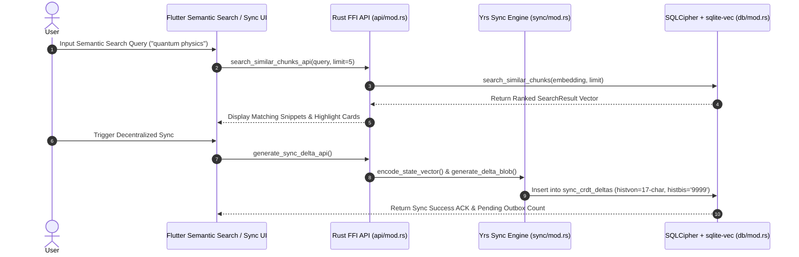

# System Design Specification: Vector Similarity Search Engine & Decentralized Yrs CRDT Sync Outbox

## 1. Overview & Objectives

This specification defines the technical design for two core platform capabilities in Agama:
1. **Local Vector Similarity Search Engine (`sqlite-vec`)**: Fast embedded 384-dimensional dense vector similarity search over text chunks and annotations without cloud APIs.
2. **Decentralized Yrs CRDT Sync Engine (`sync/mod.rs`)**: On-device state synchronization using `Yrs` (Rust Yjs CRDTs), generating binary delta blobs logged in `sync_crdt_deltas` with 17-character `histvon` timestamping.

---

## 2. Technical Architecture & Components

```
+------------------------------------------------------------------------------------+
|                         LOCAL VECTOR SEARCH & CRDT SYNC                            |
+------------------------------------+-----------------------------------------------+
| 2.1 Vector Similarity Search       | 2.2 Decentralized Yrs CRDT Engine             |
| - 384-dim Dense Cosine Distance    | - Yrs Doc State Vector Encoding               |
| - Top-K Ranking Query              | - Binary Delta Blob Generation & Merge        |
| - Flutter Semantic Search UI       | - sync_crdt_deltas Outbox Store (histvon)     |
+------------------------------------+-----------------------------------------------+
```

### 2.1 Vector Similarity Search Engine
- **Embedding Generation**: Uses `AdaptivePacingEngine::generate_embedding(text: &str)` (384-dimensional normalized float array).
- **SQLite Virtual Table (`chunk_embeddings`)**:
  ```sql
  CREATE VIRTUAL TABLE IF NOT EXISTS chunk_embeddings USING vec0(
      chunk_id TEXT PRIMARY KEY,
      embedding float[384]
  );
  ```
- **Query Function (`DatabaseEngine::search_similar_chunks`)**:
  Computes cosine similarity between `query_embedding` and active document chunks (`WHERE histbis = '9999'`), ranking by highest similarity score $S \in [0.0, 1.0]$.
- **UI Integration**:
  - `AnnotationView` search bar: Real-time query execution returning top matching text snippets and highlights.

### 2.2 Decentralized Yrs CRDT Sync Engine
- **CRDT Document (`Yrs::Doc`)**:
  - Encapsulates domain map (`annotations`, `documents`, `flashcards`).
- **Delta Generation (`SyncEngine::generate_delta_blob`)**:
  - Generates binary Yrs update blob (`yrs::updates::encoder::Encode::encode_v1`).
- **Outbox Persistence (`DatabaseEngine::insert_crdt_delta`)**:
  - Saves delta blob to `sync_crdt_deltas` table:
    - `id`: UUID
    - `entity_name`: Entity type string (e.g., `'annotations'`)
    - `entity_id`: Entity UUID
    - `crdt_clock`: Monotonic clock integer
    - `delta_blob`: Binary blob
    - `histvon`: 17-character timestamp `YYYYMMDDHHMMSSSSS`
    - `histbis`: `'9999'`
- **Remote Delta Merging (`SyncEngine::apply_remote_delta`)**:
  - Applies incoming CRDT delta blobs from WebDAV, iCloud, or P2P streams to local state with conflict-free convergence.
- **UI Integration**:
  - `SyncView` widget ([`apps/flutter_client/lib/src/features/sync/sync_view.dart`](file:///Users/yashpratap/Documents/GitHub/Agama/apps/flutter_client/lib/src/features/sync/sync_view.dart)): Sync status dashboard showing outbox pending count, WebDAV server config, and sync trigger.

---

## 3. Data Flow & Sequence Diagram



---

## 4. Verification & Testing Strategy

1. **Rust Core Tests (`cargo test`)**:
   - `test_vector_similarity_search`: Insert 3 chunks with embeddings and verify query returns closest match first.
   - `test_yrs_crdt_delta_generation_and_merge`: Verify Yrs CRDT delta blob generation, local insertion into `sync_crdt_deltas`, and remote merge convergence.
2. **Flutter UI Tests (`flutter test`)**:
   - `SyncView renders WebDAV & outbox status`: Verify sync dashboard UI controls.
   - `AnnotationView search query filters results`: Verify semantic search UI interaction.
3. **Static Analysis & Linting (`flutter analyze`)**:
   - Zero errors, zero warnings.

---
*Design specification created August 2026 for production deployment.*
