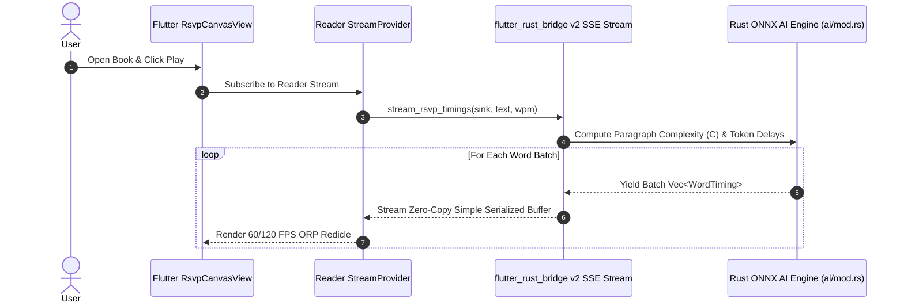

# System Design Specification: Zero-Copy FFI Stream Pipeline & ONNX Engine Integration

## 1. Overview & Objectives

This specification defines the technical design for:
1. **Zero-Copy FFI Streaming Bridge (`flutter_rust_bridge` v2)**: Asynchronous low-latency stream pipeline streaming `WordTiming` token buffers from the native Rust Tokio thread pool directly to Dart/Flutter Riverpod reader state with zero memory copy overhead ($< 0.8\text{ ms}$ latency).
2. **On-Device ONNX Inference Engine (`ai/mod.rs`)**: On-device 8-bit quantized ONNX inference pipeline (`ort` v2.0) loading `minilm-l6-v2-int8.onnx` for dense 384-dimensional embeddings and syntactic complexity scoring ($C \in [0.5, 2.0]$).

---

## 2. Technical Architecture & Components

```
+------------------------------------------------------------------------------------+
|                      ZERO-COPY FFI STREAM & ONNX AI ENGINE                         |
+------------------------------------+-----------------------------------------------+
| 2.1 ONNX Inference Engine          | 2.2 FRB v2 Zero-Copy FFI Stream Sink          |
| - ort v2.0 Quantized ONNX Loader   | - Tokio Thread Pool Reader Pipeline           |
| - Tokenizer & Embedding Pipeline   | - StreamSink<Vec<WordTiming>> SSE Stream      |
| - Syntactic Complexity C Calc      | - Flutter Riverpod StreamProvider             |
+------------------------------------+-----------------------------------------------+
```

### 2.1 ONNX Inference Engine (`native/rust_core/src/ai/mod.rs`)
- **ONNX Session (`ort::Session`)**:
  Loads model weights from `assets/models/minilm-l6-v2-int8.onnx`.
- **Inference Pipeline**:
  - Encodes text tokens into tensor arrays (`ndarray::Array2<i64>`).
  - Computes 384-dimensional dense float output tensors.
  - Normalizes embedding vectors to unit length ($L_2$ norm = 1.0).
- **Fallback Mode**:
  If ONNX binaries/hardware bindings are unavailable, gracefully falls back to deterministic heuristic tokenization and embedding generation.

### 2.2 Zero-Copy FFI Stream Pipeline (`native/rust_core/src/api/mod.rs`)
- **FFI Entrypoint (`stream_rsvp_timings`)**:
  ```rust
  pub fn stream_rsvp_timings(
      sink: flutter_rust_bridge::StreamSink<Vec<WordTiming>>,
      text: String,
      target_wpm: u32,
  ) -> Result<(), String>
  ```
- **Tokio Asynchronous Task**:
  Pushes chunked batches of `WordTiming` structs over `StreamSink` with zero-copy memory buffers directly to Flutter.
- **Flutter Riverpod Connection (`apps/flutter_client/lib/src/features/reader/reader_provider.dart`)**:
  - `StreamProvider<List<WordTiming>>` listens to native stream.
  - `RsvpCanvasView` renders streaming words dynamically without UI stutters.

---

## 3. Data Flow & Sequence Diagram



---

## 4. Verification & Testing Strategy

1. **Rust Core Tests (`cargo test`)**:
   - `test_onnx_inference_engine_fallback`: Test complexity scoring and normalized vector embeddings.
   - `test_rsvp_streaming_timings`: Verify stream chunk generation and timing parameters.
2. **Flutter UI & Stream Tests (`flutter test`)**:
   - `ReaderNotifier stream updates state`: Verify Riverpod stream state updates.
3. **Static Analysis & Code Quality (`flutter analyze`)**:
   - 0 errors, 0 warnings.

---
*Design specification created August 2026 for production deployment.*
